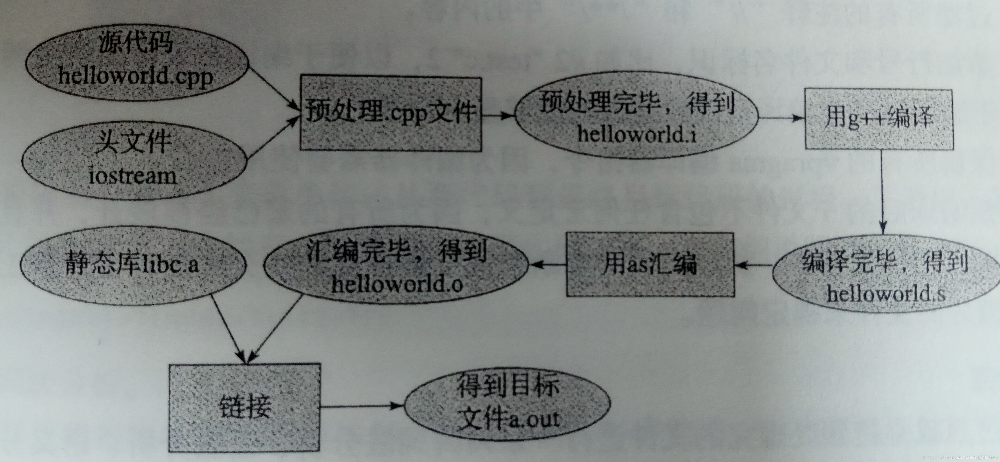

编程语言(C/C++)

> 都是语言，为什么英语比C++难这么多呢？

---

# 目录

|       Chapter 1       |           Chapter 2           |         Chapter 3         |         Chapter 4         |         Chapter 5         |
| :-------------------: | :---------------------------: | :-----------------------: | :-----------------------: | :-----------------------: |
| [编程基础](#编程基础) | [面向对象基础](#面向对象基础) | [⭐️Effective](#⭐️Effective) | [标准模板库](#标准模板库) | [编译及调试](#编译及调试) |

---

# 内容

# 编程基础

C/C++的内容又多又杂，常常看到有人罗列相关书单，觉得毫无意义，我不相信他们真的完全掌握了其中任何一本。学习任何东西，首先要掌握基本概念，基础不牢地动山摇，因为高级的内容都是通过低级的概念来描述的。当基本概念都没理解透，学习再多都是空中楼阁。这里罗列了一些听基本的问题，虽然看着不难，但是精确理解每句话中的每个词真的并不容易。

#### 1. 变量声明和定义区别？

- 声明仅仅是把变量的声明的位置及类型提供给编译器，并不分配内存空间；定义要在定义的地方为其分配存储空间。

- 相同变量可以再多处声明（外部变量extern），但只能在一处定义。

#### 2. "零值比较"？
- bool类型：if(flag)

- int类型：if(flag == 0)

- 指针类型：if(flag == NULL)

- **float类型**：if((flag >= -0.000001) && (flag <= 0. 000001))

#### 3. strlen和sizeof区别？
- sizeof是运算符，并不是函数，结果**在编译时得到而非运行中获得**；strlen是字符处理的库函数。

- sizeof参数可以是任何数据的类型或者数据（sizeof参数不退化）；strlen的参数只能是字符指针且结尾是'\0'的字符串。

- **因为sizeof值在编译时确定，所以不能用来得到动态分配（运行时分配）存储空间的大小。**

#### 4. 同一类中的不同对象可以互相赋值吗？
- 可以，但含有指针成员时需要注意。

- 对比类的对象赋值时**深拷贝和浅拷贝**。

#### 5. 结构体内存对齐问题？
- `#pragma pack(n)` 表示的是设置n字节对齐,windows默认是8，linux是4

```cpp
struct A{
    char a;		//1
    int b;		//4
    short c;	//2
};				//12
```

> - char占一个字节，起始偏移为零，int占四个字节，min(8,4)=4；所以应该偏移量为4，所以应该在char后面加上三个字节，不存放任何东西，short占两个字节，min(8,2)=2；所以偏移量是2的倍数，而short偏移量是8，是2的倍数，所以无需添加任何字节，所以第一个规则对齐之后内存状态为0xxx|0000|00。
>
> - 此时一共占了10个字节，但是还有结构体本身的对齐，min(8,4)=4；所以总体应该是4的倍数，所以还需要添加两个字节在最后面，所以内存存储状态变为了 0xxx|0000|00xx，一共占据了12个字节

- 内存对齐规则
  - 对于结构的各个成员，第一个成员位于偏移为0的位置，以后的每个数据成员的偏移量必须是 `min(#pragma pack()指定的数，这个数据成员的自身长度)` 的倍数
  - 在所有的数据成员完成各自对齐之后，结构或联合体本身也要进行对齐，对齐将按照 #pragam pack指定的数值和结构或者联合体最大数据成员长度中比较小的那个，也就是 `min(#pragram pack() , 长度最长的数据成员)`
- 需要对齐的原因
  - **平台原因（移植原因）**：不是所有的硬件平台都能访问任意地址上的任意数据，某些硬件平台只能在某些地址处取某些特定类型的数据，否则抛出硬件异常
  - **硬件原因**：经过内存对齐之后，CPU的内存访问速度大大提升。访问未对齐的内存，处理器要访问两次（数据先读高位，再读低位），访问对齐的内存，处理器只要访问一次，为了提高处理器读取数据的效率，我们使用内存对齐

#### 6. static作用是什么？在C和C++中有何区别？
- 修饰普通变量， 修改变量的存储区域和生命周期，使变量存储在静态区，在 main 函数运行前就分配了空间，在整个程序运行期间一直存在，如果有初始值就用初始值初始化它，如果没有初始值系统用默认值初始化它，自动初始化为0。 
    - 全局变量作用域：全局静态变量在声明他的文件之外是不可见的，准确地说是从定义之处开始，到文件结尾。 
    - 局部变量作用域：仍为局部作用域，当定义它的函数或者语句块结束的时候，作用域结束。但是当局部静态变量离开作用域后，并没有销毁，而是仍然驻留在内存当中，只不过我们不能再对它进行访问，直到该函数再次被调用，并且值不变；
- 修饰普通函数， 其只能在定义它的源文件中使用，不能在其他源文件中被引用

- C++的static除了上述两种用途，还可以修饰类成员变量和成员函数， 它们是属于类的，而不是某个对象，所有对象共享一个静态成员。静态成员通过<类名>::<静态成员>来使用。在 static 函数内不能访问非静态成员

- static的数据记忆性可以满足函数在不同调用期的通信，也可以满足同一个类的多个实例间的通信。

#### 7. 结构体和类的区别？

C中的strcut不能有函数，但C++中可以。C++中的struct对C中的struct进行了扩充，它已经不再只是一个包含不同数据类型的数据结构了，它已经获取了太多的功能。

- struct能包含成员函数吗？ 能！struct能继承吗？ 能！！struct能实现多态吗？ 能！！！

- **默认的继承访问权限.** struct是public的，class是private的。class B : public A就是为了指明是public继承，而不是用默认的private继承，若class B : A则是private继承

- **定义模板参数.** class这个关键字还用于定义模板参数，就像typename。但关键字struct不用于定义模板参数。

#### 8. malloc和new的区别？
- **属性不同.** new/delete是C++关键字，需要编译器支持。malloc/free是库函数，需要头文件支持C
- **申请的内存所在位置.** new操作符从自由存储区（free store）上为对象动态分配内存空间，而malloc函数从堆上动态分配内存.
- **返回类型安全性.** new操作符内存分配成功时，返回的是对象类型的指针，类型严格与对象匹配，无须进行类型转换，故new是符合类型安全性的操作符。 而malloc内存分配成功则是返回void*类型，需要通过强制类型转换将空类型指针转换成我们需要的类型。
- **内存分配失败时的返回值.** new内存分配失败时，会抛出bac_alloc异常，它不会返回NULL。malloc分配内存失败时返回NULL。
- **是否需要指定内存大小.** 使用new操作符申请内存分配时无须指定内存块的大小，编译器会根据类型信息自行计算。而malloc则需要显式地指出所需内存的大小，`int *p=(int*)malloc(25*sizeof(int));`，指向整型的指针p指向一个25个int整型空间的地址
- **是否调用构造函数/析构函数.** new会先调用operator_ new函数，申请足够的内存（通常底层使用malloc实现）。然后调用类型的构造函数，初始化成员变量，最后返回自定义类型指针。delete先调用析构函数，然后调用operator_ delete函数释放内存（通常底层使用free实现）。malloc/free是库函数，只能动态的申请和释放内存，无法强制要求其做自定义类型对象构造和析构工作。
- **能否重载.** opeartor_new/operator_delete允许重载。malloc/free不允许重载
- **已分配内存的扩充.** new/free无法直观地处理。malloc/free可以通过realloc函数扩充
- **能否相互调用.** operator_new /operator _delete的实现可以基于malloc/free，而malloc的实现不可以去调用new。

#### 9. 指针和引用区别？

- **指针有内存分配，而引用只是一个别名.** 引用声明时必须初始化，从而指向一个已经存在的对象
- **引用可以看做常量指针，指针是一个存储地址的变量.** 指针在运行时可以改变其所指向的值，而引用一旦和某个对象绑定后就不再改变。这句话可以理解为：指针可以被重新赋值以指向另一个不同的对象，但是引用则总是指向在初始化时被指定的对象，以后不能改变，但是指定的对象其内容可以改变。
- **引用创建时必须初始化，且不为空，指针创建时可以为空.** 不存在指向空值的引用这个事实，意味着使用引用的代码效率比使用指针的要高。因为在使用引用之前不需要测试它的合法性。相反，指针则应该总是被测试，防止其为空。
- **指针和引用的自增运算符意义不同.** 指针是对内存地址的自增，引用是对值的自增
- **sizeof的意义不同.** 使用sizeof看一个指针的大小是4，而引用则是被引用对象的大小
- **参数传递.** 作为参数传递时，指针需要被解引用才可以对对象进行操作，而直接对引用的修改都会改变引用所指向的对象
- **多级指针，一级引用.** 指针可以有多级指针（**p），而引用只有一级

#### 10. 宏定义和函数有何区别？
- 宏在编译阶段之前完成替换，之后被替换的文本参与编译，相当于直接插入了代码，运行时不存在函数调用，执行起来更快；函数调用在运行时需要跳转到具体调用函数。

- 宏函数属于在结构中插入代码，没有返回值；函数调用具有返回值。

- 宏函数参数没有类型，不进行类型检查；函数参数具有类型，需要检查类型。

- 宏函数不要在最后加分号。

#### 11. 宏定义和const区别？
 - 宏替换发生在编译阶段之前，属于文本插入替换；const作用发生于编译过程中。

 - 宏不检查类型；const会检查数据类型。

 - 宏定义的数据没有分配内存空间，只是插入替换掉；const定义的变量只是值不能改变，但要分配内存空间。

#### 12. 宏定义和typedef区别？
 - 宏主要用于定义常量及书写复杂的内容；typedef主要用于定义类型别名。

 - 宏替换发生在编译阶段之前，属于文本插入替换；typedef是编译的一部分。

 - 宏不检查类型；typedef会检查数据类型。

 - 宏不是语句，不在在最后加分号；typedef是语句，要加分号标识结束。

 - 注意对指针的操作，typedef char * p_char和#define p_char char *区别巨大。

#### 13. 宏定义和内联函数(inline)区别？
 - 在使用时，宏只做简单字符串替换（编译前）。而内联函数可以进行参数类型检查（编译时），且具有返回值。

 - 内联函数本身是函数，强调函数特性，具有重载等功能。

 - 内联函数可以作为某个类的成员函数，这样可以使用类的保护成员和私有成员。而当一个表达式涉及到类保护成员或私有成员时，宏就不能实现了。

#### 14. 条件编译#ifdef, #else, #endif作用？
 - 可以通过加#define，并通过#ifdef来判断，将某些具体模块包括进要编译的内容。

 - 用于子程序前加#define DEBUG用于程序调试。

 - 应对硬件的设置（机器类型等）。

 - 条件编译功能if也可实现，但条件编译可以减少被编译语句，从而减少目标程序大小。

#### 15. 区别以下几种变量？

```cpp
// 类
class A{
    private:
    const int a;                // 常对象成员，只能在初始化列表赋值

    public:
    // 构造函数
    A() : a(0) { };
    A(int x) : a(x) { };        // 初始化列表

    // const可用于对重载函数的区分
    int getValue();             // 普通成员函数
    int getValue() const;       // 常成员函数，不得修改类中的任何数据成员的值
};

void function(){
    // 对象
    A b;                 // 普通对象，可以调用全部成员函数、更新常成员变量
    const A a;           // 常对象，只能调用常成员函数
    const A *p = &a;     // 指针变量，指向常对象
    const A &q = a;      // 指向常对象的引用

    // 指针
    char greeting[] = "Hello";
    char* p1 = greeting;            	// 指针变量，指向字符数组变量
    const char* p2 = greeting;      	// 指针变量，指向字符数组常量
    char* const p3 = greeting;      	// 自身是常量的指针，指向字符数组变量
    const char* const p4 = greeting;	// 自身是常量的指针，指向字符数组常量
}

// 函数
void function1(const int Var);       // 传递过来的参数在函数内不可变
void function2(const char* Var);     // 参数指针所指内容为常量
void function3(char* const Var);     // 参数指针为常量
void function4(const int& Var);      // 引用参数在函数内为常量

// 函数返回值
const int function5();    	// 返回一个常数
const int* function6();   	// 返回一个指向常量的指针变量
int* const function7();   	// 返回一个指向变量的常指针
```

#### 16. volatile有什么作用？
 - **不可优化性.** volatile 关键字是一种类型修饰符，用它声明的类型变量表示不可以被某些编译器未知的因素（操作系统、硬件、其它线程等）更改。所以使用 volatile 告诉编译器不应对这样的对象进行优化。
 - **易变性.** volatile 关键字声明的变量，每次访问时都必须从内存中取出值（没有被 volatile 修饰的变量，可能由于编译器的优化，从 CPU 寄存器中取值）

#### 17. 什么是常引用？
 - 常引用可以理解为常量指针，形式为const typename & refname = varname。

 - 常引用下，原变量值不会被别名所修改。

 - 原变量的值可以通过原名修改。

 - 常引用通常用作只读变量别名或是形参传递。

#### 18. 区别以下指针类型？

```cpp
int *p[10]
int (*p)[10]
int *p(int)
int (*p)(int)
```

 - int *p[10]表示**指针数组**，强调数组概念，是一个数组变量，数组大小为10，数组内每个元素都是指向int类型的指针变量。
 - int (*p)[10]表示**数组指针**，强调是指针，只有一个变量，是指针类型，不过指向的是一个int类型的数组，这个数组大小是10。
 - int *p(int)是**函数声明**，函数名是p，参数是int类型的，返回值是int *类型的。
 - int (*p)(int)是**函数指针**，强调是指针，该指针指向的函数具有int类型参数，并且返回值是int类型的。
   - 函数指针 `int (*f)(int x)` 本质是指针，指向函数的指针
   - 示例：

```cpp
#include <iostream>
#include <vector>
using namespace std;
int test(int num){
    if (num % 2 == 0){
    	return 1;
    }
    return 0;
}
int main(){
    int(*func)(int x)=test;
    //int test(int x);
    //func = test;
    cout << test(2) << endl;
    system("pause");
    return 0;
}
```

#### 19. a和&a有什么区别？

```cpp
int a[10];
int (*p)[10] = &a;
```

 - a是数组名，是数组首元素地址，+1表示地址值加上一个int类型的大小，如果a的值是0x00000001，加1操作后变为0x00000005。*(a + 1) = a[1]。

 - &a是数组的指针，其类型为int (*)[10]（就是前面提到的数组指针），其加1时，系统会认为是数组首地址加上整个数组的偏移（10个int型变量），值为数组a尾元素后一个元素的地址。

 - 若(int *)p ，此时输出 *p时，其值为a[0]的值，因为被转为int *类型，解引用时按照int类型大小来读取。

#### 20. 数组名和指针（这里为指向数组首元素的指针）区别？
 - 二者均可通过增减偏移量来访问数组中的元素。

 - 数组名不是真正意义上的指针，可以理解为常指针，所以数组名没有自增、自减等操作。

 - 当数组名当做形参传递给调用函数后，就失去了原有特性，退化成一般指针，多了自增、自减操作，但sizeof运算符不能再得到原数组的大小了。

#### 21. 野指针是什么？
 - 也叫空悬指针，不是指向null的指针，是指向垃圾内存的指针。

 - 产生原因及解决办法：
      - 指针变量未及时初始化 => 定义指针变量及时初始化，要么置空。

      - 指针free或delete之后没有及时置空 => 释放操作后立即置空。

#### 22. 堆和栈的区别？

 - **管理方式不同**
   - 对于栈来讲，是由编译器自动管理，无需我们手工控制；
   - 对于堆来说，释放工作由程序员控制，容易产生memory leak。
 - **空间大小不同**
   - 一般来讲32位系统下，堆内存可以达到4G的空间，从这个角度来看堆内存几乎是没有什么限制的。
   - 但是对于栈来讲，一般都是有一定的空间大小的，例如，在VC6下面，默认的栈空间大小是1M
 - **能否产生碎片不同**
   - 对于堆来讲，频繁的new/delete势必会造成内存空间的不连续，从而造成大量的碎片，使程序效率降低。
   - 对于栈来讲，则不会存在这个问题，因为栈是先进后出的队列，他们是如此的一一对应，以至于永远都不可能有一个内存块从栈中间弹出
 - **生长方向不同**
   - 对于堆来讲，生长方向是向上的，也就是向着内存地址增加的方向；
   - 对于栈来讲，生长方向是向下的，是向着内存地址减小的方向增长；

#### 23. delete和delete[]区别？

 - delete只会调用一次析构函数。
 - delete[]会调用数组中每个元素的析构函数。

#### 24. extern关键字的作用了解吗？

- extern关键字主要修饰变量或函数，表示该函数可以跨文件访问，或者表明该变量在其他文件定义，在此处引用.

 > - **修饰变量或函数.** 被 extern 限定的函数或变量是 extern 类型的
 > - **extern "C".** extern "C" 的作用是让 C++ 编译器将 extern "C" 声明的代码当作 C 语言代码处理，可以避免 C++ 因符号修饰导致代码不能和C语言库中的符号进行链接的问题。

 1. 在c头文件中定义

    ```cpp
    #ifdef __cplusplus
    extern "C" {
    #endif
    ...
    ...
    #ifdef __cplusplus
    }
    #endif
    ```

 2. 在对应的c文件中实现

 3. 在cpp文件中通过“extern "C" 函数名”调用，或者包含c头文件

 4. **注意：** extern的使用方法是直接了当的，想引用哪个函数就用extern声明哪个函数。这样做的一个明显的好处是，会加速程序的编译（确切的说是预处理）的过程，节省时间，但若需要调用的函数太多，还是直接包含头文件吧.

 5. extern是怎么实现的

    函数和变量在编译后它们的名称都会转换成一个唯一符号，然后在链接的过程中，调用者根据这个唯一的符号去调用，这种符号是按照一定约定生成的。在c++的编译环境中调用c实现的函数时。在编译过程中，c函数add编译后的符号为“***\*_add\****”，而在c++的main中，add被编译为“***\*?add@@YAHHH@Z\****”。两个符号不一致，所以就会在链接过程中报错。一旦将add在extern “c”中声明，在c++的main中，add就被编译为“***\*_add\****”。这样符号一致，链接器就能找到了。

#### 25. 什么是智能指针，说说引用计数。

智能指针有shared_ptr, weak_ptr, unique_ptr，使用普通指针，容易造成堆内存泄露（忘记释放），二次释放，程序发生异常时内存泄露等问题等，使用智能指针能更好的管理堆内存。

shared_ptr核心要理解引用计数，什么时候销毁底层指针，还有赋值，拷贝构造时候的引用计数的变化，析构的时候要判断底层指针的引用计数为0了才能真正释放底层指针的内存

- 不能将指针直接赋值给一个智能指针，一个是类，一个是指针。例如`std::shared_ptr<int> p4 = new int(1);`
- 可以`std::shared_ptr<int>p4(new int(1));`
- 拷贝使得对象的引用计数增加1，赋值使得原对象引用计数减1，当计数为0时，自动释放内存。后来指向的对象引用计数加1，指向后来的对象
- 赋值操作符减少左操作数所指对象的引用计数（如果引用计数为减至0，则删除对象），并增加右操作数所指对象的引用计数

shared_ptr循环引用导致内存泄漏，引出weak_ptr

- 循环引用是两个强引用（shared_ptr）互相引用，使得两者的引用计数无法为0，进而无法释放，此时将循环引用的一方变为weak_ptr即可。
- weak_ptr并不修改该对象的引用计数，weak_ptr必须从一个share_ptr或另一个weak_ptr转换而来，这也说明，进行该对象的内存管理的是那个强引用的share_ptr，weak_ptr只是提供了对管理对象的一个访问手段这意味这弱引用它并不对对象的内存进行管理。
- 在功能上类似于普通指针，然而一个比较大的区别是，弱引用能检测到所管理的对象是否已经被释放，从而避免访问非法内存

```cpp
#include<iostream>
#include<memory>
using namespace std;

template <typename T>
class Node{
public:
    //Node(const T& _value):value(_value){
	Node(const T& _value) :prev(nullptr), next(nullptr), value(_value){
		cout << "Node()" << endl;
	}
	~Node(){
		cout << "~Node()" << endl;
		cout << "this:" << this << endl;
	}

	shared_ptr<Node<T>> prev;
	shared_ptr<Node<T>> next;
	//weak_ptr<Node<T>> prev;
	//weak_ptr<Node<T>> next;
	T value;
};

void Funtest(){
	shared_ptr<Node<int>> sp1(new Node<int>(1));
	shared_ptr<Node<int>> sp2(new Node<int>(2));

	cout << "sp1.use_count:" << sp1.use_count() << endl;
	cout << "sp2.use_count:" << sp2.use_count() << endl;

	sp1->next = sp2;
	sp2->prev = sp1;

	cout << "sp1.use_count:" << sp1.use_count() << endl;
	cout << "sp2.use_count:" << sp2.use_count() << endl;
}

int main()
{
	Funtest();
	system("pause");
	return 0;
}
```

上述情况造成了一个僵局，那就是析构对象时先析构sp2,可是由于sp2的空间sp1还在使用中，所以sp2.use_count减减之后为1，不释放，sp1也是相同的道理，由于sp1的空间sp2还在使用中，所以sp1.use_count减减之后为1，也不释放。sp1等着sp2先释放，sp2等着sp1先释放,二者互不相让，导致最终都没能释放，内存泄漏。

**弱引用（weak_ptr）并不修改该对象的引用计数**，weak_ptr必须从一个share_ptr或另一个weak_ptr转换而来，这也说明，进行该对象的内存管理的是那个强引用的share_ptr,weak_ptr只是提供了对管理对象的一个访问手段这意味这弱引用它并不对对象的内存进行管理。在功能上类似于普通指针，然而一个比较大的区别是，弱引用能检测到所管理的对象是否已经被释放，从而避免访问非法内存

```cpp
//智能指针的设计与实现
//智能指针类将一个计数器与类指向的对象相关联，引用计数跟踪该类有多少个对象共享同一指针。
//每次创建类的新对象时，初始化指针并将引用计数置为1；
//当对象作为另一对象的副本而创建时，拷贝构造函数拷贝指针并增加与之相应的引用计数；
//对一个对象进行赋值时，赋值操作符减少左操作数所指对象的引用计数（如果引用计数为减至0，则删除对象），并增加右操作数所指对象的引用计数；
//调用析构函数时，构造函数减少引用计数（如果引用计数减至0，则删除基础对象）。
//所有的智能指针都会重载 -> 和 * 操作符。智能指针还有许多其他功能，比较有用的是自动销毁。

#include <iostream>
#include <memory>
using namespace std;
template<typename T>
class SmartPointer{
private:
	T* _ptr;
	//在赋值时，需要修改赋值后指针的引用计数
	size_t* _count;
public:
	//初始化
	SmartPointer(T* ptr = NULL) : _ptr(ptr) {
		if (_ptr) {
			_count = new size_t(1);
		}
		else {
			_count = new size_t(0);
		}
	}

	//拷贝构造
	SmartPointer(const SmartPointer& ptr){
		if (this != &ptr) {
			this->_ptr = ptr._ptr;
			this->_count = ptr._count;
			(*this->_count)++;
		}
	}

	//重载=运算符
	SmartPointer& operator=(const SmartPointer& ptr){
		if (this->_ptr == ptr._ptr){
			return *this;
		}

		if (this->_ptr){
			(*this->_count)--;
			if (this->_count == 0) {
				delete this->_ptr;
				delete this->_count;
			}
		}

		this->_ptr = ptr._ptr;
		this->_count = ptr._count;
		(*this->_count)++;
		return *this;
	}

	//重载*
	T& operator*(){
		assert(this->_ptr == nullptr);
		return *(this->_ptr);

	}

	//重载->
	T* operator->(){
		assert(this->_ptr == nullptr);
		return this->_ptr;
	}

	~SmartPointer(){
		//因为引用计数是指针，当智能指针声明为空时，仍需释放
		if (*this->_count == 0) {
			delete this->_ptr;
			delete this->_count;
			std::cout << "释放" << std::endl;
		}
		else{
			(*this->_count)--;
		}
		if (*this->_count == 0) {
			delete this->_ptr;
			delete this->_count;
			std::cout << "释放" << std::endl;
		}
	}

	size_t use_count(){
		return *this->_count;
	}
};

int main() {
	{
		//只初始化了两次
		SmartPointer<int> sp(new int(10));
		SmartPointer<int> sp2(sp);
		SmartPointer<int> sp3(new int(20));

		std::cout << sp.use_count() << std::endl;
		std::cout << sp2.use_count() << std::endl;
		std::cout << sp3.use_count() << std::endl;
		sp2 = sp3;
		std::cout << sp.use_count() << std::endl;
		std::cout << sp2.use_count() << std::endl;
		std::cout << sp3.use_count() << std::endl;

		//SmartPointer<int> sp(NULL);
		//std::cout << sp.use_count() << std::endl;
	}

	system("pause");
	return 0;
}
```

#### 26. C++ 11智能指针

1. shared_ptr
2. unique_ptr
3. weak_ptr
4. auto_ptr（被 C++11 弃用）

- Class shared_ptr 实现共享式拥有（shared ownership）概念。多个智能指针指向相同对象，该对象和其相关资源会在 “最后一个 reference 被销毁” 时被释放。为了在结构较复杂的情景中执行上述工作，标准库提供 weak_ptr、bad_weak_ptr 和 enable_shared_from_this 等辅助类。
- Class unique_ptr 实现独占式拥有（exclusive ownership）或严格拥有（strict ownership）概念，保证同一时间内只有一个智能指针可以指向该对象。你可以移交拥有权。它对于避免内存泄漏（resource leak）——如 new 后忘记 delete ——特别有用。

**shared_ptr**

多个智能指针可以共享同一个对象，对象的最末一个拥有着有责任销毁对象，并清理与该对象相关的所有资源。

- 支持定制型删除器（custom deleter），可防范 Cross-DLL 问题（对象在动态链接库（DLL）中被 new 创建，却在另一个 DLL 内被 delete 销毁）、自动解除互斥锁

**weak_ptr**

weak_ptr 允许你共享但不拥有某对象，一旦最末一个拥有该对象的智能指针失去了所有权，任何 weak_ptr 都会自动成空（empty）。因此，在 default 和 copy 构造函数之外，weak_ptr 只提供 “接受一个 shared_ptr” 的构造函数。

- 可打破环状引用（cycles of references，两个其实已经没有被使用的对象彼此互指，使之看似还在 “被使用” 的状态）的问题

**unique_ptr**

unique_ptr 是 C++11 才开始提供的类型，是一种在异常时可以帮助避免资源泄漏的智能指针。采用独占式拥有，意味着可以确保一个对象和其相应的资源同一时间只被一个 pointer 拥有。一旦拥有着被销毁或编程 empty，或开始拥有另一个对象，先前拥有的那个对象就会被销毁，其任何相应资源亦会被释放。

- unique_ptr 用于取代 auto_ptr

**auto_ptr**

被 c++11 弃用，原因是缺乏语言特性如 “针对构造和赋值” 的 `std::move` 语义，以及其他瑕疵。

**auto_ptr 与 unique_ptr 比较**

- auto_ptr 可以赋值拷贝，复制拷贝后所有权转移；unqiue_ptr 无拷贝赋值语义，但实现了`move` 语义；
- auto_ptr 对象不能管理数组（析构调用 `delete`），unique_ptr 可以管理数组（析构调用 `delete[]` ）；

#### 27. 强制类型转换运算符

**static_cast**

- 用于非多态类型的转换

- 不执行运行时类型检查（转换安全性不如 dynamic_cast）
- 通常用于转换数值数据类型（如 float -> int）
- 可以在整个类层次结构中移动指针，子类转化为父类安全（向上转换），父类转化为子类不安全（因为子类可能有不在父类的字段或方法）

> 向上转换是一种隐式转换。

**dynamic_cast**

- 用于多态类型的转换
- 执行行运行时类型检查
- 只适用于指针或引用
- 对不明确的指针的转换将失败（返回 nullptr），但不引发异常
- 可以在整个类层次结构中移动指针，包括向上转换、向下转换

**const_cast**

- 用于删除 const、volatile 和 __unaligned 特性（如将 const int 类型转换为 int 类型 ）

**reinterpret_cast**

- 用于位的简单重新解释
- 滥用 reinterpret_cast 运算符可能很容易带来风险。 除非所需转换本身是低级别的，否则应使用其他强制转换运算符之一。
- 允许将任何指针转换为任何其他指针类型（如 `char*` 到 `int*` 或 `One_class*` 到 `Unrelated_class*` 之类的转换，但其本身并不安全）
- 也允许将任何整数类型转换为任何指针类型以及反向转换。
- reinterpret_cast 运算符不能丢掉 const、volatile 或 __unaligned 特性。
- reinterpret_cast 的一个实际用途是在哈希函数中，即通过让两个不同的值几乎不以相同的索引结尾的方式将值映射到索引。

**bad_cast**

- 由于强制转换为引用类型失败，dynamic_cast 运算符引发 bad_cast 异常。

**bad_cast 使用**

```cpp
try {  
    Circle& ref_circle = dynamic_cast<Circle&>(ref_shape);   
}  
catch (bad_cast b) {  
    cout << "Caught: " << b.what();  
} 
```

---


# 面向对象基础

能够准确理解下面这些问题是从C程序员向C++程序员进阶的基础。当然了，这只是一部分。

#### 1. 面向对象三大特性？

- **封装**：封装就是将数据和对这些数据的操作集合在一起，将实现与对外只暴露一些接口。将客观事物抽象成类，每个类对自身的数据和方法实行 protection（private，protected，public）。

- **继承**：可以让某一个类获得另一个类的属性和方法，增加了代码的可重用性。广义的继承有三种实现形式：实现继承（使用基类的属性和方法而无需额外编码的能力)、可视继承(子窗体使用父窗体的外观和实现代码)、接口继承(仅使用属性和方法,实现滞后到子类实现)。
- **多态**：同一个操作在不同对象上表现出不同的效果，是将父类对象设置成为和一个或更多它的子对象相等的技术。用子类对象给父类对象赋值之后，父类对象就可以根据当前赋值给它的子对象的特性以不同的方式运作。

多态：

- 静态多态（编译期/早绑定）
  - 函数重载

```cpp
class A{
public:
    void do(int a);
    void do(int a, int b);
};
```

- 动态多态（运行期期/晚绑定）
  - 虚函数：用 virtual 修饰成员函数，使其成为虚函数

- **注意：**
  - 普通函数（非类成员函数）不能是虚函数
  - 静态函数（static）不能是虚函数
  - 构造函数不能是虚函数
  - 内联函数不能是表现多态性时的虚函数
```cpp
class Shape{                     // 形状类
public:
    virtual double calcArea(){
        ...
    }
    virtual ~Shape();
};
class Circle : public Shape{     // 圆形类
public:
    virtual double calcArea();
    ...
};
class Rect : public Shape{       // 矩形类
public:
    virtual double calcArea();
    ...
};
int main(){
    Shape * shape1 = new Circle(4.0);
    Shape * shape2 = new Rect(5.0, 6.0);
    shape1->calcArea();         // 调用圆形类里面的方法
    shape2->calcArea();         // 调用矩形类里面的方法
    delete shape1;
    shape1 = nullptr;
    delete shape2;
    shape2 = nullptr;
    return 0;
}
```

#### 2. public/protected/private的区别？
- public修饰的变量和函数在类的内部外部都可以访问。

- protected修饰的变量和函数只能在类的内部和其派生类中访问。

- private修饰的元素只能在类内访问。

#### 3. 对象存储空间？
- 非静态成员的数据类型大小之和。

- 编译器加入的额外成员变量（如指向虚函数表的指针）。

- 为了边缘对齐优化加入的padding。

#### 4. C++空类有哪些成员函数?
- 首先，空类大小为1字节。

- 默认函数有：
    - 构造函数

    - 析构函数

    - 拷贝构造函数

    - 赋值运算符

#### 5. 构造函数能否为虚函数，析构函数呢？
- 析构函数：
    - 析构函数可以为虚函数，并且一般情况下基类析构函数要定义为虚函数。

    - 只有在基类析构函数定义为虚函数时，调用操作符delete销毁指向对象的基类指针时，才能准确调用派生类的析构函数（从该级向上按序调用虚函数），才能准确销毁数据。

    - 析构函数可以是纯虚函数，含有纯虚函数的类是抽象类，此时不能被实例化。但派生类中可以根据自身需求重新改写基类中的纯虚函数。

- 构造函数：
    - 构造函数不能定义为虚函数，因为在调用构造函数时，虚表指针并没有在对象的内存空间中，必须要构造函数调用完成后才会形成虚表指针。
- 在构造函数中可以调用虚函数，不过此时调用的是正在构造的类中的虚函数，而不是子类的虚函数，因为此时子类尚未构造好。

#### 6. 构造函数调用顺序，析构函数呢？
- 调用所有虚基类的构造函数，顺序为从左到右，从最深到最浅

- 基类的构造函数：如果有多个基类，先调用纵向上最上层基类构造函数，如果横向继承了多个类，调用顺序为派生表从左到右顺序。

- 如果该对象需要虚函数指针(vptr)，则该指针会被设置从而指向对应的虚函数表(vtbl)。

- 成员类对象的构造函数：如果类的变量中包含其他类（类的组合），需要在调用本类构造函数前先调用成员类对象的构造函数，调用顺序遵照在类中被声明的顺序。

- 派生类的构造函数。

- 析构函数与之相反。

#### 7. 拷贝构造函数中深拷贝和浅拷贝区别？
- 拷贝构造函数的参数必须加const，因为防止修改，本来就是用现有的对象初始化新的对象。

- 拷贝构造函数的使用时机
  - 使用已经创建好的对象初始化新对象 `A a; A b = a; A c(a); b = c;//b = c不是初始化，调用赋值运算符`
  - 以值传递的方式来给函数参数传值
  - 以值方式返回局部对象（不常用，一般不返回局部对象）
- 深拷贝和浅拷贝，只有当对象的成员属性在堆区开辟空间内存时，才会涉及深浅拷贝，如果仅仅是在栈区开辟内存，则默认的拷贝构造函数和析构函数就可以满足要求。
  - **浅拷贝**：使用默认拷贝构造函数，拷贝过程中是按字节复制的，对于指针型成员变量只复制指针本身，而不复制指针所指向的目标，因此涉及堆区开辟内存时，会将两个成员属性指向相同的内存空间，从而在释放时导致内存空间被多次释放，使得程序down掉。
  - **浅拷贝的问题**：当出现类的等号赋值时，系统会调用默认的拷贝函数——即浅拷贝，它能够完成成员的一一复制。当数据成员中没有指针时，浅拷贝是可行的。但当数据成员中有指针时，如果采用简单的浅拷贝，则两类中的两个指针将指向同一个地址，当对象快结束时，会调用两次free函数，指向的内存空间已经被释放掉，再次free会报错；另外，一片空间被两个不同的子对象共享了，只要其中的一个子对象改变了其中的值，那另一个对象的值也跟着改变了所以，这时，必须采用深拷贝
  - **深拷贝**：自定义拷贝构造函数，在堆内存中另外申请空间来储存数据，从而解决指针悬挂的问题。**需要注意自定义析构函数中应该释放掉申请的内存**

- 在定义类或者结构体，这些结构的时候，最后都重写拷贝函数，避免浅拷贝这类不易发现但后果严重的错误产生

#### 8. 拷贝构造函数和赋值运算符重载的区别？
- 拷贝构造函数是函数，赋值运算符是运算符重载。

- 拷贝构造函数会生成新的类对象，赋值运算符不能。

- 拷贝构造函数是直接构造一个新的类对象，所以在初始化对象前不需要检查源对象和新建对象是否相同；赋值运算符需要上述操作并提供两套不同的复制策略，另外赋值运算符中如果原来的对象有内存分配则需要先把内存释放掉。

- 形参传递是调用拷贝构造函数（调用的被赋值对象的拷贝构造函数），但并不是所有出现"="的地方都是使用赋值运算符，如下：

    ```cpp
    Student s;
    Student s1 = s; // 调用拷贝构造函数
    Student s2;
s2 = s;    		// 赋值运算符操作
    ```

**注：类中有指针变量时要重写析构函数、拷贝构造函数和赋值运算符**

#### 9. 虚函数和纯虚函数区别？
- 类里如果声明了虚函数，这个函数是实现的，哪怕是空实现，它的作用就是为了能让这个函数在它的子类里面可以被覆盖（override），这样的话，编译器就可以使用后期绑定来达到多态了。纯虚函数只是一个接口，是个函数的声明而已，它要留到子类里去实现。
- 虚函数在子类里面可以不重写；但纯虚函数必须在子类实现才可以实例化子类。
- 虚函数的类用于 “实作继承”，继承接口的同时也继承了父类的实现。纯虚函数关注的是接口的统一性，实现由子类完成。
- 带纯虚函数的类叫抽象类，这种类不能直接生成对象，而只有被继承，并重写其虚函数后，才能使用。抽象类被继承后，子类可以继续是抽象类，也可以是普通类。

#### 10. 覆盖、重载和隐藏的区别？
 - 覆盖是派生类中重新定义的函数，其函数名、参数列表（个数、类型和顺序）、返回值类型和父类完全相同，只有函数体有区别。派生类虽然继承了基类的同名函数，但用派生类对象调用该函数时会根据对象类型调用相应的函数。覆盖只能发生在类的成员函数中。

 - 隐藏是指派生类函数屏蔽了与其同名的函数，这里仅要求基类和派生类函数同名即可。其他状态同覆盖。可以说隐藏比覆盖涵盖的范围更宽泛，毕竟参数不加限定。

 - 重载是具有相同函数名但参数列表不同（个数、类型或顺序）的两个函数（不关心返回值），当调用函数时根据传递的参数列表来确定具体调用哪个函数。重载可以是同一个类的成员函数也可以是类外函数。

#### 11. 在main执行之前执行的代码可能是什么？

- 全局对象的构造函数。

#### 12. 哪几种情况必须用到初始化成员列表？

- 初始化一个const成员。

- 初始化一个reference成员。

- 调用一个基类的构造函数，而该函数有一组参数。

- 调用一个数据成员对象的构造函数，而该函数有一组参数。

#### 13. 什么是虚指针？

 - 虚指针或虚函数指针是虚函数的实现细节。

 - 虚函数指针和虚函数表

   > - 前提发生了多态，每个类中都有虚函数表，最开始的父类创建虚函数表，后面的子类继承父类的虚函数表，然后对虚函数重写
   > - 虚函数重写（覆盖）的实质就是，重写父类虚函数表中的父类虚函数地址；
   > - 实现多态的流程：虚函数指针->虚函数表->函数指针->入口地址，**虚函数表（vftable）属于类**，或者说这个类的所有对象共享一个虚函数表；**虚函数指针（vfptr）属于单个对象**。
   > - 在程序调用时，先创建对象，编译器在对象的内存结构头部添加一个虚函数指针，进行动态绑定，虚函数指针指向对象所属类的虚函数表。
   > - 虚函数表是一个指针数组，其元素是虚函数的指针，每个元素对应一个函数的指针。如果子类对父类中的一个或多个虚函数进行重写，子类的虚函数表中的元素顺序，会按照父类中的虚函数顺序存储，之后才是自己类的函数顺序。
   > - 编译器根本不会去区分，传进来的是子类对象还是父类对象，而是关心调用的函数是否为虚函数。如果是虚函数，就根据不同对象的 vptr 指针找属于自己的函数。父类对象和子类对象都有 vfptr 指针，传入对象不同，编译器会根据 vfptr 指针，到属于自己虚函数表中找自己的函数。即：vptr--->虚函数表------>函数的入口地址，从而实现了迟绑定(在运行的时候，才会去判断)。

#### 14. 重载和函数模板的区别？

- 重载需要多个函数，这些函数彼此之间函数名相同，但参数列表中参数数量和类型不同。在区分各个重载函数时我们并不关心函数体。

- 模板函数是一个通用函数，函数的类型和形参不直接指定而用虚拟类型来代表。但只适用于参个数相同而类型不同的函数。

#### 15. this指针是什么？

 - **为什么会有this指针** 在类实例化对象时，只有非静态成员变量属于对象本身，剩余的静态成员变量，静态函数，非静态函数都不属于对象本身，因此非静态成员函数只会实例一份，多个同类型对象会共用一块代码，由于类中每个实例后的对象都有独一无二的地址，因此不同的实例对象调用成员函数时，函数需要知道是谁在调用它，因此引入了this指针。
 - **this指针的作用** this指针是隐含在对象成员函数内的一种指针。当一个对象被创建后，它的每一个成员函数都会含有一个系统自动生成的隐含指针this。this指针指向被调用的成员函数所属的对象（谁调用成员函数，this指向谁），*this表示对象本身，非静态成员函数中才有this，静态成员函数内部没有
   - this 并不是一个常规变量，而是个右值，所以不能取得 this 的地址（不能 &this）。
   - 对非静态成员函数默认添加了this指针，类型为ClassName *const this
 - **this指针使用**
   - 当形参与成员变量名相同时，用this指针来区分
   - 为实现对象的链式引用，在类的非静态成员函数中返回对象本身，可以用return \*this，this指向对象，\*this表示对象本身。

#### 16. 类模板和函数模板？

 - 通过template或template实现，主要用于数据的类型参数化，简化代码，有类模板和函数模板，函数模板是用于生成函数的，类模板则是用于生成类的
 - 类模板和函数模板定义
   - template声明下面是函数定义，则为函数模板，否则为类模板。
   - 注意：每个函数模板前必须有且仅有一个template声明，不允许多个template声明后只有一个函数模板，也不允许一个template声明后有多个函数模板(类模板同理)。
 - 类模板与函数模板的区别
   - 类模板不支持自动类型推导
   - 数据类型可以有默认参数.

#### 17. 构造函数和析构函数调用时机？

 - 全局范围中的对象：构造函数在所有函数调用之前执行，在主函数执行完调用析构函数。
 - 局部自动对象：建立对象时调用构造函数，离开作用域时调用析构函数。
 - 动态分配的对象：建立对象时调用构造函数，调用释放时调用析构函数。
 - 静态局部变量对象：建立时调用一次构造函数，主函数结束时调用析构函数。

#### 18. 构造函数能否实现多态/虚函数指针什么时候初始化？

两个问题本质是一样的，构造函数不能实现多态

 - 对象在创建时,由编译器对Vptr指针进行初始化，只有当对象的构造完全结束后Vptr的指向才最终确定。
 - 子类中虚函数指针的初始化过程. 当定义一个子类对象的时候比较麻烦，因为构造子类对象的时候会首先调用父类的构造函数，然后再调用子类的构造函数。当调用父类的构造函数的时候，此时会创建Vptr指针，该指针会指向父类的虚函数表；然后再调用子类的构造函数，子类继承父类的虚函数指针，此时Vptr又被赋值指向子类的虚函数表。

#### 19. 虚函数可以是内联函数吗
- 虚函数可以是内联函数，内联是可以修饰虚函数的，但是当虚函数表现多态性的时候不能内联。
- 内联是在编译期内联，而虚函数的多态性在运行期，编译器无法知道运行期调用哪个代码，因此虚函数表现为多态性时（运行期）不可以内联。
- inline virtual 唯一可以内联的时候是：编译器知道所调用的对象是哪个类（如 Base::who()），这只有在编译器具有实际对象而不是对象的指针或引用时才会发生。

#### 20. 为什么空类大小不为0

- sizeof(空class) = 1，为了确保两个不同对象的地址不同。
  
#### 21. 友元全局函数、友元类、友元成员函数

- 友元主要是为了访问类中的私有成员（包括属性和方法），会破坏C++的封装性，尽量不使用

- 友元全局函数
  - 友元函数声明可以在类中的任何地方，一般放在类定义的开始或结尾
  - 一个函数可以是多个类的友元函数，只需要在各个类中分别声明
  - 友元函数在类内声明，类外定义，定义和使用时不需加作用域和类名，与普通函数无异。
- 友元类
  - 友元不可继承
  - 友元是单向的，类A是类B的友元类，但类B不一定是类A的
  - 友元不具有传递性，类A是类B的友元类，类B是类C的友元类，但类A不一定是类C的友元类。
- 友元成员函数
  - 使类B中的成员函数成为类A的友元函数，这样类B的该成员函数就可以访问类A的所有成员

#### 22. 运算符重载及++重载实现

- 运算符重载基本属性
  - 运算符重载的目的是扩展C++中提供的运算符的适用范围，使之能作用于对象，或自定义的数据类型
  - 运算符重载的实质是函数重载，可以重载为普通成员函数，也可以重载为成员函数
  - 运算符重载也是多态的一种，和函数重载称为静态多态，表示函数地址早绑定，在编译阶段就确定好了地址

- 运算符重载总结
  - 重载运算符()，[] ，->， =的时候，运算符重载函数必须声明为类的成员函数
  - 重载运算符<<，>>的时候，运算符只能通过全局函数配合友元函数进行重载
  - 不要重载&&和||运算符，因为无法实现短路原则。

- i++和++i实现
  - C++内置类型的后置++返回的是变量的拷贝，也就是不可修改的值；前置++返回的是变量的引用，因此可以作为修改的左值。即++（++a）或（++a）++都可以，但++（a++）不可以，（C++默认必须修改a的值，如果不修改则报错）。

```cpp
//++i
int& int::operator++(){
    *this +=1;
    return *this;
}

//i++，注意后置++有占位参数以区分跟前置++不同
const int int::operator++(int){
    int oldValue=*this;
    ++(*this);
    return oldValue;
}
```

#### 23. 内存分配和管理

**malloc、calloc、realloc、alloca**

1. malloc：申请指定字节数的内存。申请到的内存中的初始值不确定。
2. calloc：为指定长度的对象，分配能容纳其指定个数的内存。申请到的内存的每一位（bit）都初始化为 0。
3. realloc：更改以前分配的内存长度（增加或减少）。当增加长度时，可能需将以前分配区的内容移到另一个足够大的区域，而新增区域内的初始值则不确定。
4. alloca：在栈上申请内存。程序在出栈的时候，会自动释放内存。但是需要注意的是，alloca 不具可移植性, 而且在没有传统堆栈的机器上很难实现。alloca 不宜使用在必须广泛移植的程序中。C99 中支持变长数组 (VLA)，可以用来替代 alloca。

**malloc、free**

1. 用于分配、释放内存

malloc、free 使用

申请内存，确认是否申请成功

```cpp
char *str = (char*) malloc(100);
assert(str != nullptr);
```

释放内存后指针置空

```cpp
free(p); 
p = nullptr;
```

**new、delete**

1. new / new[]：完成两件事，先底层调用 malloc 分配了内存，然后调用构造函数（创建对象）。
2. delete/delete[]：也完成两件事，先调用析构函数（清理资源），然后底层调用 free 释放空间。
3. new 在申请内存时会自动计算所需字节数，而 malloc 则需我们自己输入申请内存空间的字节数。

new、delete 使用

申请内存，确认是否申请成功

```cpp
int main(){
    T* t = new T();     // 先内存分配 ，再构造函数
    delete t;           // 先析构函数，再内存释放
    return 0;
}
```

# ⭐️Effective

#### Effective C++

1. 视 C++ 为一个语言联邦（C、Object-Oriented C++、Template C++、STL）
2. 宁可以编译器替换预处理器（尽量以 `const`、`enum`、`inline` 替换 `#define`）
3. 尽可能使用 const
4. 确定对象被使用前已先被初始化（构造时赋值（copy 构造函数）比 default 构造后赋值（copy assignment）效率高）
5. 了解 C++ 默默编写并调用哪些函数（编译器暗自为 class 创建 default 构造函数、copy 构造函数、copy assignment 操作符、析构函数）
6. 若不想使用编译器自动生成的函数，就应该明确拒绝（将不想使用的成员函数声明为 private，并且不予实现）
7. 为多态基类声明 virtual 析构函数（如果 class 带有任何 virtual 函数，它就应该拥有一个 virtual 析构函数）
8. 别让异常逃离析构函数（析构函数应该吞下不传播异常，或者结束程序，而不是吐出异常；如果要处理异常应该在非析构的普通函数处理）
9. 绝不在构造和析构过程中调用 virtual 函数（因为这类调用从不下降至 derived class）
10. 令 `operator=` 返回一个 `reference to *this` （用于连锁赋值）
11. 在 `operator=` 中处理 “自我赋值”
12. 赋值对象时应确保复制 “对象内的所有成员变量” 及 “所有 base class 成分”（调用基类复制构造函数）
13. 以对象管理资源（资源在构造函数获得，在析构函数释放，建议使用智能指针，资源取得时机便是初始化时机（Resource Acquisition Is Initialization，RAII））
14. 在资源管理类中小心 copying 行为（普遍的 RAII class copying 行为是：抑制 copying、引用计数、深度拷贝、转移底部资源拥有权（类似 auto_ptr））
15. 在资源管理类中提供对原始资源（raw resources）的访问（对原始资源的访问可能经过显式转换或隐式转换，一般而言显示转换比较安全，隐式转换对客户比较方便）
16. 成对使用 new 和 delete 时要采取相同形式（`new` 中使用 `[]` 则 `delete []`，`new` 中不使用 `[]` 则 `delete`）
17. 以独立语句将 newed 对象存储于（置入）智能指针（如果不这样做，可能会因为编译器优化，导致难以察觉的资源泄漏）
18. 让接口容易被正确使用，不易被误用（促进正常使用的办法：接口的一致性、内置类型的行为兼容；阻止误用的办法：建立新类型，限制类型上的操作，约束对象值、消除客户的资源管理责任）
19. 设计 class 犹如设计 type，需要考虑对象创建、销毁、初始化、赋值、值传递、合法值、继承关系、转换、一般化等等。
20. 宁以 pass-by-reference-to-const 替换 pass-by-value （前者通常更高效、避免切割问题（slicing problem），但不适用于内置类型、STL迭代器、函数对象）
21. 必须返回对象时，别妄想返回其 reference（绝不返回 pointer 或 reference 指向一个 local stack 对象，或返回 reference 指向一个 heap-allocated 对象，或返回 pointer 或 reference 指向一个 local static 对象而有可能同时需要多个这样的对象。）
22. 将成员变量声明为 private（为了封装、一致性、对其读写精确控制等）
23. 宁以 non-member、non-friend 替换 member 函数（可增加封装性、包裹弹性（packaging flexibility）、机能扩充性）
24. 若所有参数（包括被this指针所指的那个隐喻参数）皆须要类型转换，请为此采用 non-member 函数
25. 考虑写一个不抛异常的 swap 函数
26. 尽可能延后变量定义式的出现时间（可增加程序清晰度并改善程序效率）
27. 尽量少做转型动作（旧式：`(T)expression`、`T(expression)`；新式：`const_cast<T>(expression)`、`dynamic_cast<T>(expression)`、`reinterpret_cast<T>(expression)`、`static_cast<T>(expression)`、；尽量避免转型、注重效率避免 dynamic_casts、尽量设计成无需转型、可把转型封装成函数、宁可用新式转型）
28. 避免使用 handles（包括 引用、指针、迭代器）指向对象内部（以增加封装性、使 const 成员函数的行为更像 const、降低 “虚吊号码牌”（dangling handles，如悬空指针等）的可能性）
29. 为 “异常安全” 而努力是值得的（异常安全函数（Exception-safe functions）即使发生异常也不会泄露资源或允许任何数据结构败坏，分为三种可能的保证：基本型、强列型、不抛异常型）
30. 透彻了解 inlining 的里里外外（inlining 在大多数 C++ 程序中是编译期的行为；inline 函数是否真正 inline，取决于编译器；大部分编译器拒绝太过复杂（如带有循环或递归）的函数 inlining，而所有对 virtual 函数的调用（除非是最平淡无奇的）也都会使 inlining 落空；inline 造成的代码膨胀可能带来效率损失；inline 函数无法随着程序库的升级而升级）
31. 将文件间的编译依存关系降至最低（如果使用 object references 或 object pointers 可以完成任务，就不要使用 objects；如果能够，尽量以 class 声明式替换 class 定义式；为声明式和定义式提供不同的头文件）
32. 确定你的 public 继承塑模出 is-a（是一种）关系（适用于 base classes 身上的每一件事情一定适用于 derived classes 身上，因为每一个 derived class 对象也都是一个 base class 对象）
33. 避免遮掩继承而来的名字（可使用 using 声明式或转交函数（forwarding functions）来让被遮掩的名字再见天日）
34. 区分接口继承和实现继承（在 public 继承之下，derived classes 总是继承 base class 的接口；pure virtual 函数只具体指定接口继承；非纯 impure virtual 函数具体指定接口继承及缺省实现继承；non-virtual 函数具体指定接口继承以及强制性实现继承）
35. 考虑 virtual 函数以外的其他选择（如 Template Method 设计模式的 non-virtual interface（NVI）手法，将 virtual 函数替换为 “函数指针成员变量”，以 `tr1::function` 成员变量替换 virtual 函数，将继承体系内的 virtual 函数替换为另一个继承体系内的 virtual 函数）
36. 绝不重新定义继承而来的 non-virtual 函数
37. 绝不重新定义继承而来的缺省参数值，因为缺省参数值是静态绑定（statically bound），而 virtual 函数却是动态绑定（dynamically bound）
38. 通过复合塑模 has-a（有一个）或 “根据某物实现出”（在应用域（application domain），复合意味 has-a（有一个）；在实现域（implementation domain），复合意味着 is-implemented-in-terms-of（根据某物实现出））
39. 明智而审慎地使用 private 继承（private 继承意味着 is-implemented-in-terms-of（根据某物实现出），尽可能使用复合，当 derived class 需要访问 protected base class 的成员，或需要重新定义继承而来的时候 virtual 函数，或需要 empty base 最优化时，才使用 private 继承）
40. 明智而审慎地使用多重继承（多继承比单一继承复杂，可能导致新的歧义性，以及对 virtual 继承的需要，但确有正当用途，如 “public 继承某个 interface class” 和 “private 继承某个协助实现的 class”；virtual 继承可解决多继承下菱形继承的二义性问题，但会增加大小、速度、初始化及赋值的复杂度等等成本）
41. 了解隐式接口和编译期多态（class 和 templates 都支持接口（interfaces）和多态（polymorphism）；class 的接口是以签名为中心的显式的（explicit），多态则是通过 virtual 函数发生于运行期；template 的接口是奠基于有效表达式的隐式的（implicit），多态则是通过 template 具现化和函数重载解析（function overloading resolution）发生于编译期）
42. 了解 typename 的双重意义（声明 template 类型参数是，前缀关键字 class 和 typename 的意义完全相同；请使用关键字 typename 标识嵌套从属类型名称，但不得在基类列（base class lists）或成员初值列（member initialization list）内以它作为 base class 修饰符）
43. 学习处理模板化基类内的名称（可在 derived class templates 内通过 `this->` 指涉 base class templates 内的成员名称，或藉由一个明白写出的 “base class 资格修饰符” 完成）
44. 将与参数无关的代码抽离 templates（因类型模板参数（non-type template parameters）而造成代码膨胀往往可以通过函数参数或 class 成员变量替换 template 参数来消除；因类型参数（type parameters）而造成的代码膨胀往往可以通过让带有完全相同二进制表述（binary representations）的实现类型（instantiation types）共享实现码）
45. 运用成员函数模板接受所有兼容类型（请使用成员函数模板（member function templates）生成 “可接受所有兼容类型” 的函数；声明 member templates 用于 “泛化 copy 构造” 或 “泛化 assignment 操作” 时还需要声明正常的 copy 构造函数和 copy assignment 操作符）
46. 需要类型转换时请为模板定义非成员函数（当我们编写一个 class template，而它所提供之 “与此 template 相关的” 函数支持 “所有参数之隐式类型转换” 时，请将那些函数定义为 “class template 内部的 friend 函数”）
47. 请使用 traits classes 表现类型信息（traits classes 通过 templates 和 “templates 特化” 使得 “类型相关信息” 在编译期可用，通过重载技术（overloading）实现在编译期对类型执行 if...else 测试）
48. 认识 template 元编程（模板元编程（TMP，template metaprogramming）可将工作由运行期移往编译期，因此得以实现早期错误侦测和更高的执行效率；TMP 可被用来生成 “给予政策选择组合”（based on combinations of policy choices）的客户定制代码，也可用来避免生成对某些特殊类型并不适合的代码）
49. 了解 new-handler 的行为（set_new_handler 允许客户指定一个在内存分配无法获得满足时被调用的函数；nothrow new 是一个颇具局限的工具，因为它只适用于内存分配（operator new），后继的构造函数调用还是可能抛出异常）
50. 了解 new 和 delete 的合理替换时机（为了检测运用错误、收集动态分配内存之使用统计信息、增加分配和归还速度、降低缺省内存管理器带来的空间额外开销、弥补缺省分配器中的非最佳齐位、将相关对象成簇集中、获得非传统的行为）
51. 编写 new 和 delete 时需固守常规（operator new 应该内涵一个无穷循环，并在其中尝试分配内存，如果它无法满足内存需求，就应该调用 new-handler，它也应该有能力处理 0 bytes 申请，class 专属版本则还应该处理 “比正确大小更大的（错误）申请”；operator delete 应该在收到 null 指针时不做任何事，class 专属版本则还应该处理 “比正确大小更大的（错误）申请”）
52. 写了 placement new 也要写 placement delete（当你写一个 placement operator new，请确定也写出了对应的 placement operator delete，否则可能会发生隐微而时断时续的内存泄漏；当你声明 placement new 和 placement delete，请确定不要无意识（非故意）地遮掩了它们地正常版本）
53. 不要轻忽编译器的警告
54. 让自己熟悉包括 TR1 在内的标准程序库（TR1，C++ Technical Report 1，C++11 标准的草稿文件）
55. 让自己熟悉 Boost（准标准库）

---

#### More Effective c++

1. 仔细区别 pointers 和 references（当你知道你需要指向某个东西，而且绝不会改变指向其他东西，或是当你实现一个操作符而其语法需求无法由 pointers 达成，你就应该选择 references；任何其他时候，请采用 pointers）
2. 最好使用 C++ 转型操作符（`static_cast`、`const_cast`、`dynamic_cast`、`reinterpret_cast`）
3. 绝不要以多态（polymorphically）方式处理数组（多态（polymorphism）和指针算术不能混用；数组对象几乎总是会涉及指针的算术运算，所以数组和多态不要混用）
4. 非必要不提供 default constructor（避免对象中的字段被无意义地初始化）
5. 对定制的 “类型转换函数” 保持警觉（单自变量 constructors 可通过简易法（explicit 关键字）或代理类（proxy classes）来避免编译器误用；隐式类型转换操作符可改为显式的 member function 来避免非预期行为）
6. 区别 increment/decrement 操作符的前置（prefix）和后置（postfix）形式（前置式累加后取出，返回一个 reference；后置式取出后累加，返回一个 const 对象；处理用户定制类型时，应该尽可能使用前置式 increment；后置式的实现应以其前置式兄弟为基础）
7. 千万不要重载 `&&`，`||` 和 `,` 操作符（`&&` 与 `||` 的重载会用 “函数调用语义” 取代 “骤死式语义”；`,` 的重载导致不能保证左侧表达式一定比右侧表达式更早被评估）
8. 了解各种不同意义的 new 和 delete（`new operator`、`operator new`、`placement new`、`operator new[]`；`delete operator`、`operator delete`、`destructor`、`operator delete[]`）
9. 利用 destructors 避免泄漏资源（在 destructors 释放资源可以避免异常时的资源泄漏）
10. 在 constructors 内阻止资源泄漏（由于 C++ 只会析构已构造完成的对象，因此在构造函数可以使用 try...catch 或者 auto_ptr（以及与之相似的 classes） 处理异常时资源泄露问题）
11. 禁止异常流出 destructors 之外（原因：一、避免 terminate 函数在 exception 传播过程的栈展开（stack-unwinding）机制种被调用；二、协助确保 destructors 完成其应该完成的所有事情）
12. 了解 “抛出一个 exception” 与 “传递一个参数” 或 “调用一个虚函数” 之间的差异（第一，exception objects 总是会被复制（by pointer 除外），如果以 by value 方式捕捉甚至被复制两次，而传递给函数参数的对象则不一定得复制；第二，“被抛出成为 exceptions” 的对象，其被允许的类型转换动作比 “被传递到函数去” 的对象少；第三，catch 子句以其 “出现于源代码的顺序” 被编译器检验对比，其中第一个匹配成功者便执行，而调用一个虚函数，被选中执行的是那个 “与对象类型最佳吻合” 的函数）
13. 以 by reference 方式捕获 exceptions（可避免对象删除问题、exception objects 的切割问题，可保留捕捉标准 exceptions 的能力，可约束 exception object 需要复制的次数）
14. 明智运用 exception specifications（exception specifications 对 “函数希望抛出什么样的 exceptions” 提供了卓越的说明；也有一些缺点，包括编译器只对它们做局部性检验而很容易不经意地违反，与可能会妨碍更上层的 exception 处理函数处理未预期的 exceptions）
15. 了解异常处理的成本（粗略估计，如果使用 try 语句块，代码大约整体膨胀 5%-10%，执行速度亦大约下降这个数；因此请将你对 try 语句块和 exception specifications 的使用限制于非用不可的地点，并且在真正异常的情况下才抛出 exceptions）
16. 谨记 80-20 法则（软件的整体性能几乎总是由其构成要素（代码）的一小部分决定的，可使用程序分析器（program profiler）识别出消耗资源的代码）
17. 考虑使用 lazy evaluation（缓式评估）（可应用于：Reference Counting（引用计数）来避免非必要的对象复制、区分 operator[] 的读和写动作来做不同的事情、Lazy Fetching（缓式取出）来避免非必要的数据库读取动作、Lazy Expression Evaluation（表达式缓评估）来避免非必要的数值计算动作）
18. 分期摊还预期的计算成本（当你必须支持某些运算而其结构几乎总是被需要，或其结果常常被多次需要的时候，over-eager evaluation（超急评估）可以改善程序效率）

---

# 标准模板库

STL内容虽然看起来很多，单独成书都不是问题（《STL源码剖析》），但从实际使用状况来看，我认为只需要知道以下几点就可以了：

- 怎么用？

    各种STL基本的增删改查怎么使用。每种容器都提供了很多操作，但实际增删改查我们通常只需要掌握透彻一种方式即可。有些功能只是出于通用性考虑才存在的，但对于相应的STL这些操作完全可以忽略。所以我对STL使用的看法是，不需要花太多时间去了解所有功能，只要掌握最基本的即可，要把精力放在对需求的了解并选择适合的数据结构。

- 怎么实现？

    本身STL就是封装了我们常用的数据结构，所以最先需要了解每种数据结构的特性。而且了解实现方式对我们能够准确、高效使用STL打下了基础。

- 如何避免错误？

    在第二阶段了解了STL的实现之后，我们已经可以很清楚地知道他们底层使用的是什么数据结构以及该数据结构做什么操作比较高效。但还有一点需要注意的就是怎么才能用对他们，避免一些未知的错误，比如迭代器失效问题。

#### 红黑树

面试时候现场写红黑树代码的概率几乎为0，但是红黑树一些基本概念还是需要掌握的。

1. 它是二叉排序树（继承二叉排序树特显）：
    - 若左子树不空，则左子树上所有结点的值均小于或等于它的根结点的值。

    - 若右子树不空，则右子树上所有结点的值均大于或等于它的根结点的值。

    - 左、右子树也分别为二叉排序树。

2. 它满足如下几点要求：
    - 树中所有节点非红即黑。

    - 根节点必为黑节点。

    - 红节点的子节点必为黑（黑节点子节点可为黑）。

    - 从根到NULL的任何路径上黑结点数相同。

3. 查找时间一定可以控制在O(logn)。

4. 红黑树的节点定义如下：
```C++
enum Color {
    RED = 0,
    BLACK = 1
};
struct RBTreeNode {
    struct RBTreeNode*left, *right, *parent;
    int key;
    int data;
    Color color;
};
```

所以对红黑树的操作需要满足两点：1.满足二叉排序树的要求；2.满足红黑树自身要求。通常在找到节点通过和根节点比较找到插入位置之后，还需要结合红黑树自身限制条件对子树进行左旋和右旋。

相比于AVL树，红黑树平衡性要稍微差一些，不过创建红黑树时所需的旋转操作也会少很多。相比于最简单的BST，BST最差情况下查找的时间复杂度会上升至O(n)，而红黑树最坏情况下查找效率依旧是O(logn)。所以说红黑树之所以能够在STL及Linux内核中被广泛应用就是因为其折中了两种方案，既减少了树高，又减少了建树时旋转的次数。

从红黑树的定义来看，红黑树从根到NULL的每条路径拥有相同的黑节点数（假设为n），所以最短的路径长度为n（全为黑节点情况）。因为红节点不能连续出现，所以路径最长的情况就是插入最多的红色节点，在黑节点数一致的情况下，最可观的情况就是黑红黑红排列......最长路径不会大于2n，这里路径长就是树高。

#### STL容器

|        容器        |   底层数据结构    | 时间复杂度                                                | 有无序 | 可不可重复 | 其他                                                         |
| :----------------: | :---------------: | :-------------------------------------------------------- | ------ | ---------- | ------------------------------------------------------------ |
|       array        |       数组        | 随机读改 O(1)                                             | 无序   | 可重复     | 支持随机访问                                                 |
|       vector       |       数组        | 随机读改、尾部插入、尾部删除 O(1) 头部插入、头部删除 O(n) | 无序   | 可重复     | 支持随机访问                                                 |
|       deque        |     双端队列      | 头尾插入、头尾删除 O(1)                                   | 无序   | 可重复     | 一个中央控制器 + 多个缓冲区，支持首尾快速增删，支持随机访问  |
|    forward_list    |     单向链表      | 插入、删除 O(1)                                           | 无序   | 可重复     | 不支持随机访问                                               |
|        list        |     双向链表      | 插入、删除 O(1)                                           | 无序   | 可重复     | 不支持随机访问                                               |
|       stack        |   deque / list    | 顶部插入、顶部删除 O(1)                                   | 无序   | 可重复     | deque 或 list 封闭头端开口，不用 vector 的原因应该是容量大小有限制，扩容耗时 |
|       queue        |   deque / list    | 尾部插入、头部删除 O(1)                                   | 无序   | 可重复     | deque 或 list 封闭头端开口，不用 vector 的原因应该是容量大小有限制，扩容耗时 |
|   priority_queue   | vector + max-heap | 插入、删除 O(log2n)                                       | 有序   | 可重复     | vector容器+heap处理规则                                      |
|        set         |      红黑树       | 插入、删除、查找 O(log2n)                                 | 有序   | 不可重复   |                                                              |
|      multiset      |      红黑树       | 插入、删除、查找 O(log2n)                                 | 有序   | 可重复     |                                                              |
|        map         |      红黑树       | 插入、删除、查找 O(log2n)                                 | 有序   | 不可重复   |                                                              |
|      multimap      |      红黑树       | 插入、删除、查找 O(log2n)                                 | 有序   | 可重复     |                                                              |
|   unordered_set    |      哈希表       | 插入、删除、查找 O(1) 最差 O(n)                           | 无序   | 不可重复   |                                                              |
| unordered_multiset |      哈希表       | 插入、删除、查找 O(1) 最差 O(n)                           | 无序   | 可重复     |                                                              |
|   unordered_map    |      哈希表       | 插入、删除、查找 O(1) 最差 O(n)                           | 无序   | 不可重复   |                                                              |
| unordered_multimap |      哈希表       | 插入、删除、查找 O(1) 最差 O(n)                           | 无序   | 可重复     |                                                              |


---

# 编译及调试

#### 编译tu



各平台文件格式

| 平台       | 可执行文件 | 目标文件 | 动态库/共享对象       | 静态库       |
| ---------- | ---------- | -------- | --------------------- | ------------ |
| Windows    | exe        | obj      | dll                   | lib          |
| Unix/Linux | ELF、out   | o        | so                    | a            |
| Mac        | Mach-O     | o        | dylib、tbd、framework | a、framework |

#### **编译链接过程**

1. 预编译（预编译器处理如 `#include`、`#define` 等预编译指令，生成 `.i` 或 `.ii` 文件）
2. 编译（编译器进行词法分析、语法分析、语义分析、中间代码生成、目标代码生成、优化，生成 `.s` 文件）
3. 汇编（汇编器把汇编码翻译成机器码，生成 `.o` 文件）
4. 链接（连接器进行地址和空间分配、符号决议、重定位，生成 `.out` 文件）

#### GCC编译流程

- 预处理阶段：hello.c -- "gcc -E 预处理，头文件展开，宏替换" --> hello.i
- 编译阶段：hello.i -- "gcc -S 生成汇编文件" --> hello.s
- 汇编阶段：hello.s -- "gcc -c 生成二进制文件" --> hello.o
- 链接阶段：hello.o -- "调用 ld 进行链接" --> a.out

#### makefile编写

对于大的工程通常涉及很多头文件和源文件，编译起来很很麻烦，makefile正是为了自动化编译产生的，makefile像是编译说明书，指示编译的步骤和条件，之后被make命令解释。

- 基本规则

    ```shell
    A:B
    (tab)<command>
    ```

    其中A是语句最后生成的文件，B是生成A所依赖的文件，比如生成test.o依赖于test.c和test.h，则写成test.o:test.c test.h。接下来一行的开头必须是tab，再往下就是实际的命令了，比如gcc -c test.c -o test.o。

- 变量

    makefile的书写非常像shell脚本，可以在文件中定义"变量名 = 变量值"的形式，之后需要使用这个变量时只需要写一个$符号加上变量名即可，当然，和shell一样，最好用()包裹起语句来。

#### 编译性语言和解释性语言的本质区别和优缺点

- 根本区别
  - 计算机不能直接的理解高级语言，只能直接理解机器语言，所以必须要把高级语言翻译成机器语言，计算机才能执行高级语言的编写的程序。翻译的方式有两种，一个是编译，一个是解释。**两种方式只是翻译的时间不同**。
  - 解释性语言不用编译，在运行时翻译
  - 编译性语言是编译的时候直接编译成机器可以执行的语言，编译和运行是分开的，但是不能跨平台。比如exe文件，以后要运行的话就不用重新编译了，直接使用编译的结果就行了（exe文件），因为翻译只做了一次，运行的时不要翻译，所以编译型语言的程序执行效率高
- 编译性语言的优缺点
  - 优点：运行速度快，代码效率高，编译后程序不可以修改，保密性好
  - 缺点：代码需要经过编译方可运行，可移植性差，只能在兼容的操作系统上运行。
- 解释性语言的优缺点
  - 优点：可移植性好，只要有解释环境，可以在不同的操作系统上运行。
  - 缺点：运行需要解释环境，运行起来比编译的要慢，占用的资源也要多一些，代码效率低，代码修改后就可以运行，不需要编译过程