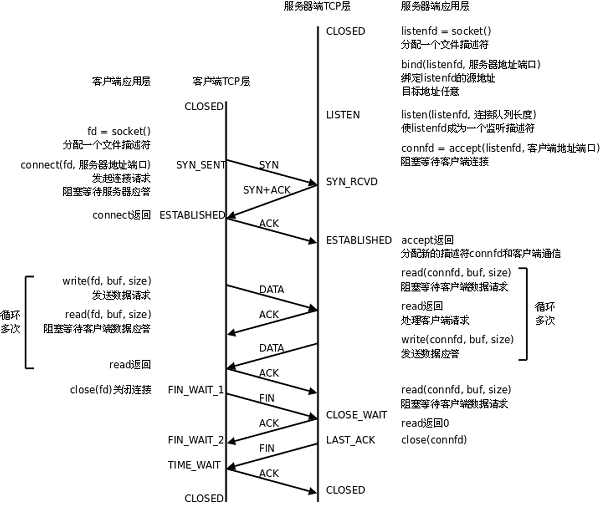

# 计算机网络

> 重点在TCP/IP协议和HTTP协议。

---

# 目录

| Chapter 1 | Chapter 2 | Chapter 3| Chapter 4 | Chapter 5 | Chapter 6 |
| :---------: | :---------: | :---------: | ----------- | ----------- | ----------- |
|[计算机网络体系结构](#计算机网络体系结构)|[物理层](#物理层)|[数据链路层](#数据链路层)| [网络层](#网络层) | [传输层](#传输层) | [应用层](#应用层) |

---

# 内容

### 计算机网络体系结构


### 各层作用及协议

| 分层       | 作用                                                | 协议                                                |
| ---------- | --------------------------------------------------- | --------------------------------------------------- |
| 物理层     | 通过媒介传输比特，确定机械及电气规范（比特 Bit）    | RJ45、CLOCK、IEEE802.3（中继器，集线器）            |
| 数据链路层 | 将比特组装成帧和点到点的传递（帧 Frame）            | PPP、FR、HDLC、VLAN、MAC（网桥，交换机）            |
| 网络层     | 负责数据包从源到宿的传递和网际互连（包 Packet）     | IP、ICMP、ARP、RARP、OSPF、IPX、RIP、IGRP（路由器） |
| 运输层     | 提供端到端的可靠报文传递和错误恢复（ 段Segment）    | TCP、UDP、SPX                                       |
| 会话层     | 建立、管理和终止会话（会话协议数据单元 SPDU）       | NFS、SQL、NETBIOS、RPC                              |
| 表示层     | 对数据进行翻译、加密和压缩（表示协议数据单元 PPDU） | JPEG、MPEG、ASII                                    |
| 应用层     | 允许访问OSI环境的手段（应用协议数据单元 APDU）      | FTP、DNS、Telnet、SMTP、HTTP、WWW、NFS              |

### 物理层

* 传输数据的单位：比特
* 数据传输系统：源系统（源点、发送器） --> 传输系统 --> 目的系统（接收器、终点）

- 通道：
  - 单向通道（单工通道）：只有一个方向通信，没有反方向交互，如广播
  - 双向交替通信（半双工通信）：通信双方都可发消息，但不能同时发送或接收
  - 双向同时通信（全双工通信）：通信双方可以同时发送和接收信息

- 通道复用技术：
  - 频分复用（FDM，Frequency Division Multiplexing）：不同用户在不同频带，所用用户在同样时间占用不同带宽资源
  - 时分复用（TDM，Time Division Multiplexing）：不同用户在同一时间段的不同时间片，所有用户在不同时间占用同样的频带宽度
  - 波分复用（WDM，Wavelength Division Multiplexing）：光的频分复用
  - 码分复用（CDM，Code Division Multiplexing）：不同用户使用不同的码，可以在同样时间使用同样频带通信

---

### 数据链路层

主要信道：

- 点对点信道
- 广播信道

**点对点信道**

- 数据单元：帧
- 三个基本问题：
  - 封装成帧：把网络层的 IP 数据报封装成帧，`SOH - 数据部分 - EOT`
  - 透明传输：不管数据部分什么字符，都能传输出去；可以通过字节填充方法解决（冲突字符前加转义字符）
  - 差错检测：降低误码率（BER，Bit Error Rate），广泛使用循环冗余检测（CRC，Cyclic Redundancy Check）

- 点对点协议（Point-to-Point Protocol）：
  - 点对点协议（Point-to-Point Protocol）：用户计算机和 ISP 通信时所使用的协议

**广播信道**

- 广播通信：
  - 硬件地址（物理地址、MAC 地址）
  - 单播（unicast）帧（一对一）：收到的帧的 MAC 地址与本站的硬件地址相同
  - 广播（broadcast）帧（一对全体）：发送给本局域网上所有站点的帧
  - 多播（multicast）帧（一对多）：发送给本局域网上一部分站点的帧

---

### 网络层

- IP（Internet Protocol，网际协议）是为计算机网络相互连接进行通信而设计的协议。
- ARP（Address Resolution Protocol，地址解析协议）
- ICMP（Internet Control Message Protocol，网际控制报文协议）
- IGMP（Internet Group Management Protocol，网际组管理协议）

**IP 网际协议**

IP 地址分类：

- `IP 地址 ::= {<网络号>,<主机号>}`

| IP 地址类别 | 网络号                                 | 网络范围               | 主机号 | IP 地址范围                  |
| ----------- | -------------------------------------- | ---------------------- | ------ | ---------------------------- |
| A 类        | 8bit，第一位固定为 0                   | 0 —— 127               | 24bit  | 1.0.0.0 —— 127.255.255.255   |
| B 类        | 16bit，前两位固定为 10                 | 128.0 —— 191.255       | 16bit  | 128.0.0.0 —— 191.255.255.255 |
| C 类        | 24bit，前三位固定为 110                | 192.0.0 —— 223.255.255 | 8bit   | 192.0.0.0 —— 223.255.255.255 |
| D 类        | 前四位固定为 1110，后面为多播地址      |                        |        |                              |
| E 类        | 前五位固定为 11110，后面保留为今后所用 |                        |        |                              |

IP 数据报格式：


**ICMP 网际控制报文协议**

ICMP 报文格式：


应用：

- PING（Packet InterNet Groper，分组网间探测）测试两个主机之间的连通性
- TTL（Time To Live，生存时间）该字段指定 IP 包被路由器丢弃之前允许通过的最大网段数量

**内部网关协议**

- RIP（Routing Information Protocol，路由信息协议）
- OSPF（Open Sortest Path First，开放最短路径优先）

**外部网关协议**

- BGP（Border Gateway Protocol，边界网关协议）

**IP多播**

- IGMP（Internet Group Management Protocol，网际组管理协议）
- 多播路由选择协议

**VPN 和 NAT**

- VPN（Virtual Private Network，虚拟专用网）
- NAT（Network Address Translation，网络地址转换）

**路由表包含什么？**

1. 网络 ID（Network ID, Network number）：就是目标地址的网络 ID。
2. 子网掩码（subnet mask）：用来判断 IP 所属网络
3. 下一跳地址/接口（Next hop / interface）：就是数据在发送到目标地址的旅途中下一站的地址。其中 interface 指向 next hop（即为下一个 route）。一个自治系统（AS, Autonomous system）中的 route 应该包含区域内所有的子网络，而默认网关（Network id: `0.0.0.0`, Netmask: `0.0.0.0`）指向自治系统的出口。

4. 根据应用和执行的不同，路由表可能含有如下附加信息：
   1. 花费（Cost）：就是数据发送过程中通过路径所需要的花费。
   2. 路由的服务质量
   3. 路由中需要过滤的出/入连接列表

---

### 传输层

协议：

- TCP（Transmission Control Protocol，传输控制协议）
- UDP（User Datagram Protocol，用户数据报协议）

端口：

| 应用程序 | FTP  | TELNET | SMTP | DNS  | TFTP | HTTP | HTTPS | SNMP |
| -------- | ---- | ------ | ---- | ---- | ---- | ---- | ----- | ---- |
| 端口号   | 21   | 23     | 25   | 53   | 69   | 80   | 443   | 161  |

TCP 报文结构


TCP 首部


2. 描述TCP头部？
    - 序号（32bit）：传输方向上字节流的字节编号。初始时序号会被设置一个随机的初始值（ISN），之后每次发送数据时，序号值 = ISN + 数据在整个字节流中的偏移。假设A -> B且ISN = 1024，第一段数据512字节已经到B，则第二段数据发送时序号为1024 + 512。用于解决网络包乱序问题。
    
    - 确认号（32bit）：接收方对发送方TCP报文段的响应，其值是收到的序号值 + 1。
    
    - 首部长（4bit）：标识首部有多少个4字节 * 首部长，最大为15，即60字节。
    
    - 标志位（6bit）：
        - URG：紧急比特（urgent），当 `URG＝1` 时，表明紧急指针字段有效，代表该封包为紧急封包。它告诉系统此报文段中有紧急数据，应尽快传送(相当于高优先级的数据)， 且上图中的 Urgent Pointer 字段也会被启用。
        - ACK：确认比特（Acknowledge）。只有当 `ACK＝1` 时确认号字段才有效，代表这个封包为确认封包。当 `ACK＝0` 时，确认号无效。
        - PSH：（Push function）若为 1 时，代表要求对方立即传送缓冲区内的其他对应封包，而无需等缓冲满了才送。
        - RST：复位比特(Reset)，当 `RST＝1` 时，表明 TCP 连接中出现严重差错（如由于主机崩溃或其他原因），必须释放连接，然后再重新建立运输连接。
        - SYN：同步比特(Synchronous)，SYN 置为 1，就表示这是一个连接请求或连接接受报文，通常带有 SYN 标志的封包表示『主动』要连接到对方的意思。
        - FIN：终止比特(Final)，用来释放一个连接。当 `FIN＝1` 时，表明此报文段的发送端的数据已发送完毕，并要求释放运输连接。
        
    - 窗口（16bit）：接收窗口。用于告知对方（发送方）本方的缓冲还能接收多少字节数据。用于解决流控。
    
    - 校验和（16bit）：接收端用CRC检验整个报文段有无损坏。
    
3. 三次握手过程？
    - 第一次：客户端发含SYN位，SEQ_NUM = S的包到服务器。（客 -> SYN_SEND）
    - 第二次：服务器发含ACK，SYN位且ACK_NUM = S + 1，SEQ_NUM = P的包到客户机。（服 -> SYN_RECV）
    - 第三次：客户机发送含ACK位，ACK_NUM = P + 1的包到服务器。（客 -> ESTABLISH，服 -> ESTABLISH）
    
    

4. 四次挥手过程？
    - 第一次：客户机发含FIN位，SEQ = Q的包到服务器。（客 -> FIN_WAIT_1）
    - 第二次：服务器发送含ACK且ACK_NUM = Q + 1的包到服务器。（服 -> CLOSE_WAIT，客 -> FIN_WAIT_2）
        - 此处有等待
    - 第三次：服务器发送含FIN且SEQ_NUM = R的包到客户机。（服 -> LAST_ACK，客 -> TIME_WAIT）
        - 此处有等待
    - 第四次：客户机发送最后一个含有ACK位且ACK_NUM = R + 1的包到客户机。（服 -> CLOSED）
    
    
    
5. 为什么握手是三次，挥手是四次？
    - 为什么TCP三次握手，不能两次或者四次吗？
      - 三次握手是为了防止，客户端的请求报文在网络滞留，客户端超时重传了请求报文，服务端建立连接，传输数据，释放连接之后，服务器又收到了客户端滞留的请求报文，建立连接一直等待客户端发送数据。
      - 服务器对客户端的请求进行回应(第二次握手)后，就会理所当然的认为连接已建立，而如果客户端并没有收到服务器的回应呢？此时，客户端仍认为连接未建立，服务器会对已建立的连接保存必要的资源，如果大量的这种情况，服务器会崩溃。
      - 服务器端给客户端发送同步及确认报文时可以合并，四次会浪费时间
    - 为什么TCP四次挥手，不能三次吗？
      - 当客户端确认发送完数据且知道服务器已经接收完了，想要关闭发送数据口（当然确认信号还是可以发），就会发FIN给服务器。
      - 服务器收到客户端发送的FIN，表示收到了，就会发送ACK回复。
      - 但这时候服务器可能还在发送数据，没有想要关闭数据口的意思，所以服务器的FIN与ACK不是同时发送的，而是等到服务器数据发送完了，才会发送FIN给客户端。
      - 客户端收到服务器发来的FIN，知道服务器的数据也发送完了，回复ACK， 客户端等待2MSL以后，没有收到服务器传来的任何消息，知道服务器已经收到自己的ACK了，客户端就关闭链接，服务器也关闭链接（服务器比客户端早关闭）。
6. TCP连接状态？
    - CLOSED：初始状态。
    - LISTEN：服务器处于监听状态。
    - SYN_SEND：客户端socket执行CONNECT连接，发送SYN包，进入此状态。
    - SYN_RECV：服务端收到SYN包并发送服务端SYN包，进入此状态。
    - ESTABLISH：表示连接建立。客户端发送了最后一个ACK包后进入此状态，服务端接收到ACK包后进入此状态。
    - FIN_WAIT_1：终止连接的一方（通常是客户机）发送了FIN报文后进入。等待对方FIN。
    - CLOSE_WAIT：（假设服务器）接收到客户机FIN包之后等待关闭的阶段。在接收到对方的FIN包之后，自然是需要立即回复ACK包的，表示已经知道断开请求。但是本方是否立即断开连接（发送FIN包）取决于是否还有数据需要发送给客户端，若有，则在发送FIN包之前均为此状态。
    - FIN_WAIT_2：此时是半连接状态，即有一方要求关闭连接，等待另一方关闭。客户端接收到服务器的ACK包，但并没有立即接收到服务端的FIN包，进入FIN_WAIT_2状态。
    - LAST_ACK：服务端发动最后的FIN包，等待最后的客户端ACK响应，进入此状态。
    - TIME_WAIT：客户端收到服务端的FIN包，并立即发出ACK包做最后的确认，在此之后的2MSL时间称为TIME_WAIT状态。
    - TCP 有限状态机图片
    
    
    
7. 解释FIN_WAIT_2，CLOSE_WAIT状态和TIME_WAIT状态？
    - FIN_WAIT_2：
        - 半关闭状态。
        
        - 发送断开请求一方还有接收数据能力，但已经没有发送数据能力。
    
    - CLOSE_WAIT状态：
        - 被动关闭连接一方接收到FIN包会立即回应ACK包表示已接收到断开请求。
        
        - 被动关闭连接一方如果还有剩余数据要发送就会进入CLOSED_WAIT状态。
    
    - TIME_WAIT状态：
        - 又叫2MSL等待状态。
        
        - 如果客户端直接进入CLOSED状态，如果服务端没有接收到最后一次ACK包会在超时之后重新再发FIN包，此时因为客户端已经CLOSED，所以服务端就不会收到ACK而是收到RST。所以TIME_WAIT状态目的是防止最后一次握手数据没有到达对方而触发重传FIN准备的。
        
        - 在2MSL时间内，同一个socket不能再被使用，否则有可能会和旧连接数据混淆（如果新连接和旧连接的socket相同的话）。

8. 解释RTO，RTT和超时重传？
    - 超时重传：发送端发送报文后若长时间未收到确认的报文则需要重发该报文。可能有以下几种情况：
      
        - 发送的数据没能到达接收端，所以对方没有响应。
        
        - 接收端接收到数据，但是ACK报文在返回过程中丢失。
        
        - 接收端拒绝或丢弃数据。
    
    - RTO：从上一次发送数据，因为长期没有收到ACK响应，到下一次重发之间的时间。就是重传间隔。
        - 通常每次重传RTO是前一次重传间隔的两倍，计量单位通常是RTT。例：1RTT，2RTT，4RTT，8RTT......
        
        - 重传次数到达上限之后停止重传。
    
    - RTT：数据从发送到接收到对方响应之间的时间间隔，即数据报在网络中一个往返用时。大小不稳定。

9. 流量控制原理？
   
    - 目的是接收方通过TCP头窗口字段告知发送方本方可接收的最大数据量，用以解决发送速率过快导致接收方不能接收的问题。所以流量控制是点对点控制。
    - TCP是双工协议，双方可以同时通信，所以发送方接收方各自维护一个发送窗和接收窗。
      - 发送窗：用来限制发送方可以发送的数据大小，其中发送窗口的大小由接收端返回的TCP报文段中窗口字段来控制，接收方通过此字段告知发送方自己的缓冲（受系统、硬件等限制）大小。
      - 接收窗：用来标记可以接收的数据大小。
    - TCP是流数据，
      - 发送出去的数据流可以被分为以下四部分：已发送且被确认部分 | 已发送未被确认部分 | 未发送但可发送部分 | 不可发送部分，其中发送窗 = 已发送未确认部分 + 未发但可发送部分。
      - 接收到的数据流可分为：已接收 | 未接收但准备接收 | 未接收不准备接收。接收窗 = 未接收但准备接收部分。
    - 发送窗内数据只有当接收到接收端某段发送数据的ACK响应时才移动发送窗，左边缘紧贴刚被确认的数据。接收窗也只有接收到数据且最左侧连续时才移动接收窗口。
9. 拥塞控制原理？

    拥塞控制目的是防止数据被过多注网络中导致网络资源（路由器、交换机等）过载。因为拥塞控制涉及网络链路全局，所以属于全局控制。控制拥塞使用拥塞窗口。

    TCP拥塞控制算法：

    主要是四个算法：慢启动、拥塞避免、拥塞发生、快速恢复。

    （拥塞窗口  cwnd 和发送窗口  swnd ）

    **慢启动**

    TCP 在刚建立连接完成后，首先是有个慢启动的过程，就是一点一点的提高发送数据包的数量，

    慢启动的算法记住一个规则就行：**当发送方每收到一个 ACK，就拥塞窗口 cwnd 的大小就会加 1**。所以慢启动算法发包的个数是指数性的增长。

    那慢启动涨到什么时候是个头呢？有一个叫慢启动门限  ssthresh （slow start threshold）状态变量。

    - 当  cwnd <  ssthresh 时，使用「慢启动算法」
    - 当  cwnd >=  ssthresh 时，就会使用「拥塞避免算法」

    **拥塞避免算法**

    前面说道，当拥塞窗口  cwnd 「超过」慢启动门限  ssthresh 就会进入拥塞避免算法。

    一般来说  ssthresh 的大小是  65535 字节。

    拥塞避免算法的规则是：

    - **每当收到一个 ACK 时，cwnd 增加 1/cwnd**。所以可以发现，拥塞避免算法就是将原本慢启动算法的指数增长变成了线性增长，还是增长阶段，但是增长速度缓慢了一些。

    - 就这么一直增长着后，网络就会慢慢进入了拥塞的状况了，于是就会出现丢包现象，这时就需要对丢失的数据包进行重传。当触发了重传机制，也就进入了「拥塞发生算法」。

    **拥塞发生**

    当网络出现拥塞，也就是会发生数据包重传，重传机制主要有两种：超时重传、快速重传。

    - 当发生了「超时重传」，则就会使用拥塞发生算法。sshresh 和 cwnd 的值会发生变化：ssthresh 设为  cwnd/2 ，cwnd 重置为  1。
    - 还有更好的方式，就是「快速重传算法」，当接收方发现丢了一个中间包的时候，发送三次前一个包的 ACK，于是发送端就会快速地重传，不必等待超时再重传。TCP 认为这种情况不严重，则  cwnd  设置为原来的一半 ; ssthresh = cwnd ; 进入快速恢复算法。

    **快速恢复**

    快速重传和快速恢复算法一般同时使用，快速恢复算法是认为，你还能收到 3 个重复 ACK 说明网络也不那么糟糕，所以没有必要像  RTO 超时那么强烈。而且进入快速恢复之前， cwnd 和  ssthresh 已被更新了：

    快速恢复算法如下：

    - 拥塞窗口  cwnd = ssthresh + 3 （ 3 的意思是确认有 3 个数据包被收到了）；重传丢失的数据包；如果再收到重复的 ACK，那么 cwnd 增加 1；
    - 如果收到新数据的 ACK 后，把 cwnd 设置为第一步中的 ssthresh 的值，原因是该 ACK 确认了新的数据，说明从 duplicated ACK 时的数据都已收到，该恢复过程已经结束，可以回到恢复之前的状态了，也即再次进入拥塞避免状态。

    TCP的拥塞控制图

     

    

10. 如何区分流量控制和拥塞控制？
    - 流量控制属于通信双方协商；拥塞控制涉及通信链路全局。
    - 流量控制需要通信双方各维护一个发送窗、一个接收窗，对任意一方，接收窗大小由自身决定，发送窗大小由接收方响应的TCP报文段中窗口值确定；拥塞控制的拥塞窗口大小变化由试探性发送一定数据量数据探查网络状况后而自适应调整。
    - 实际最终发送窗口 = min{流控发送窗口，拥塞窗口}。

11. TCP如何提供可靠数据传输的？
     - 建立连接（标志位）：通信前确认通信实体存在。

     - 序号机制（序号、确认号）：确保了数据是按序、完整到达。

     - 数据校验（校验和）：CRC校验全部数据。

     - 超时重传（定时器）：保证因链路故障未能到达数据能够被多次重发。

     - 窗口机制（窗口）：提供流量控制，避免过量发送。

     - 拥塞控制：同上。

12. TCP soctet交互流程？
     - 服务器：
         - 创建socket -> int socket(int domain, int type, int protocol);
             - domain：协议域，决定了socket的地址类型，IPv4为AF_INET。
             
             - type：指定socket类型，SOCK_STREAM为TCP连接。
             
             - protocol：指定协议。IPPROTO_TCP表示TCP协议，为0时自动选择type默认协议。
         
         - 绑定socket和端口号 -> int bind(int sockfd, const struct sockaddr *addr, socklen_t addrlen);
             - sockfd：socket返回的套接字描述符，类似于文件描述符fd。
             
             - addr：有个sockaddr类型数据的指针，指向的是被绑定结构变量。
             ```c
             // IPv4的sockaddr地址结构
             struct sockaddr_in {
                 sa_family_t sin_family;    	// 协议类型，AF_INET
                 in_port_t sin_port;    		// 端口号
                 struct in_addr sin_addr;    // IP地址
             };
             struct in_addr {
                 uint32_t s_addr;
             }
             ```
         
             - addrlen：地址长度。
         
         - 监听端口号 -> int listen(int sockfd, int backlog);
             - sockfd：要监听的sock描述字。
             
             - backlog：socket可以排队的最大连接数。
         
         - 接收用户请求 -> int accept(int sockfd, struct sockaddr *addr, socklen_t *addrlen);
             - sockfd：服务器socket描述字。
             
             - addr：指向地址结构指针。
             
             - addrlen：协议地址长度。
             
             - 注：一旦accept某个客户机请求成功将返回一个全新的描述符用于标识具体客户的TCP连接。
         
         - 从socket中读取字符 -> ssize_t read(int fd, void *buf, size_t count);
             - fd：连接描述字。
             
             - buf：缓冲区buf。
             
             - count：缓冲区长度。
             
             - 注：大于0表示读取的字节数，返回0表示文件读取结束，小于0表示发生错误。
         
         - 关闭socket -> int close(int fd);
         
             - fd：accept返回的连接描述字，每个连接有一个，生命周期为连接周期。
         
             - 注：sockfd是监听描述字，一个服务器只有一个，用于监听是否有连接；fd是连接描述字，用于每个连接的操作。

     - 客户机：
         - 创建socket -> int socket(int domain, int type, int protocol);

         - 连接指定计算机 -> int connect(int sockfd, struct sockaddr* addr, socklen_t addrlen);
             - sockfd客户端的sock描述字。

             - addr：服务器的地址。

             - addrlen：socket地址长度。

         - 向socket写入信息 -> ssize_t write(int fd, const void *buf, size_t count);
             - fd、buf、count：同read中意义。

             - 大于0表示写了部分或全部数据，小于0表示出错。

         - 关闭oscket -> int close(int fd);
             - fd：同服务器端fd。
         
         

UDP 报文结构


UDP 首部


13. TCP、UDP概念与区别

- TCP全称传输控制协议，面向连接的安全的流式传输协议；
- UDP全称用户数据报协议，面向无连接的不安全的报式传输协议；

- 连接：
  - TCP是面向连接的传输层协议，即传输数据之前必须先建立好连接；
  - UDP无连接；

- 服务对象：
  - TCP是点对点的两点间服务，即一条TCP连接只能有两个端点；
  - UDP支持一对一，一对多，多对一，多对多的交互通信。

- 可靠性：
  - TCP是可靠托付：无差错，不丢失，不重复，按序到达；
  - UDP是尽最大努力交付，不保证可靠交付；

- 拥塞控制，流量控制：
  - TCP有拥塞控制和流量控制，保证数据传输的安全性；
  - UDP没有拥塞控制，网络拥塞不会影响主机的发送效率；

- 报文长度：
  - TCP是动态报文长度，即TCP报文长度根据接收方的窗口大小和当前网络拥塞情况决定的，流式传输；
  - UDP是面向报文，不合并，不拆分，保留上层（应用层）传下来报文的边界，直接传输报文；

- 首部开销：
  - TCP首部开销大，首部20个字节；
  - UDP首部开销小，首部8个字节。

- 应用场景：
  - 要求通信数据完整性，则应该选用TCP协议（如文件传输，重要状态更新，登陆数据传输等等）；
  - 要求通信实时性，使用UDP协议（如视频传输，通话，屏幕共享软件）；

14. TCP 黏包问题

- 原因
  - TCP 是一个基于字节流的传输服务（UDP 基于报文的），“流” 意味着 TCP 所传输的数据是没有边界的。所以可能会出现两个数据包黏在一起的情况。

- 解决
  - 发送定长包。如果每个消息的大小都是一样的，那么在接收对等方只要累计接收数据，直到数据等于一个定长的数值就将它作为一个消息。
  - 包头加上包体长度。包头是定长的 4 个字节，说明了包体的长度。接收对等方先接收包头长度，依据包头长度来接收包体。
  - 在数据包之间设置边界，如添加特殊符号 `\r\n` 标记。FTP 协议正是这么做的。但问题在于如果数据正文中也含有 `\r\n`，则会误判为消息的边界。
  - 使用更加复杂的应用层协议。

---

### 应用层

**HTTP**

HTTP协议工作在应用层，端口号是80。HTTP协议被用于网络中两台计算机间的通信，相比于TCP/IP这些底层协议，HTTP协议更像是高层标记型语言，浏览器根据从服务器得到的HTTP响应体中分别得到报文头，响应头和信息体（HTML正文等），之后将HTML文件解析并呈现在浏览器上。同样，我们在浏览器地址栏输入网址之后，浏览器相当于用户代理帮助我们组织好报文头，请求头和信息体（可选），之后通过网络发送到服务器，，服务器根据请求的内容准备数据。所以如果想要完全弄明白HTTP协议，你需要写一个浏览器 + 一个Web服务器，一侧来生成请求信息，一侧生成响应信息。

从网络分层模型来看，HTTP工作在应用层，其在传输层由TCP协议为其提供服务。所以可以猜到，HTTP请求前，客户机和服务器之间一定已经通过三次握手建立起连接，其中套接字中服务器一侧的端口号为HTTP周知端口80。在请求和传输数据时也是有讲究的，通常一个页面上不只有文本数据，有时会内嵌很多图片，这时候有两种选择可以考虑。

- 一种是对每一个文件都建立一个TCP连接，传送完数据后立马断开，通过多次这样的操作获取引用的所有数据，但是这样一个页面的打开需要建立多次连接，效率会低很多。

- 另一种是对于有多个资源的页面，传送完一个数据后不立即断开连接，在同一次连接下多次传输数据直至传完，但这种情况有可能会长时间占用服务器资源，降低吞吐率。

上述两种模式分别是HTTP 1.0和HTTP 1.1版本的默认方式，具体是什么含义会在后面详细解释。

**HTTP工作流程**

一次完整的HTTP请求事务包含以下四个环节：

- 建立起客户机和服务器连接。

- 建立连接后，客户机发送一个请求给服务器。

- 服务器收到请求给予响应信息。

- 客户端浏览器将返回的内容解析并呈现，断开连接。

**HTTP协议结构**

**请求报文**

对于HTTP请求报文我们可以通过以下两种方式比较直观的看到：一是在浏览器调试模式下（F12）看请求响应信息，二是通过wireshark或者tcpdump抓包实现。通过前者看到的数据更加清晰直观，通过后者抓到的数据更真实。但无论是用哪种方式查看，得到的请求报文主题体信息都是相同的，对于请求报文，主要包含以下四个部分，每一行数据必须通过"\r\n"分割，这里可以理解为行末标识符。

- 报文头（只有一行）

    结构：method  uri  version

    - method

        HTTP的请求方法，一共有9中，但GET和POST占了99%以上的使用频次。GET表示向特定资源发起请求，当然也能提交部分数据，不过提交的数据以明文方式出现在URL中。POST通常用于向指定资源提交数据进行处理，提交的数据被包含在请求体中，相对而言比较安全些。

    - uri

        用来指代请求的文件，≠URL。

    - version

        HTTP协议的版本，该字段有HTTP/1.0和HTTP/1.1两种。

- 请求头（多行）

    在HTTP/1.1中，请求头除了Host都是可选的。包含的头五花八门，这里只介绍部分。

    - Host：指定请求资源的主机和端口号。端口号默认80。

    - Connection：值为keep-alive和close。keep-alive使客户端到服务器的连接持续有效，不需要每次重连，此功能为HTTP/1.1预设功能。

    - Accept：浏览器可接收的MIME类型。假设为text/html表示接收服务器回发的数据类型为text/html，如果服务器无法返回这种类型，返回406错误。

    - Cache-control：缓存控制，Public内容可以被任何缓存所缓存，Private内容只能被缓存到私有缓存，non-cache指所有内容都不会被缓存。

    - Cookie：将存储在本地的Cookie值发送给服务器，实现无状态的HTTP协议的会话跟踪。

    - Content-Length：请求消息正文长度。

    另有User-Agent、Accept-Encoding、Accept-Language、Accept-Charset、Content-Type等请求头这里不一一罗列。由此可见，请求报文是告知服务器请求的内容，而请求头是为了提供服务器一些关于客户机浏览器的基本信息，包括编码、是否缓存等。


- 空行（一行）

- 可选消息体（多行）

**响应报文**

响应报文是服务器对请求资源的响应，通过上面提到的方式同样可以看到，同样地，数据也是以"\r\n"来分割。

- 报文头（一行）

    结构：version status_code status_message

    - version

        描述所遵循的HTTP版本。

    - 状态码（Status-Code）

        - 1xx：表示通知信息，如请求收到了或正在进行处理
          - 100 Continue：继续，客户端应继续其请求
          - 101 Switching Protocols 切换协议。服务器根据客户端的请求切换协议。只能切换到更高级的协议，例如，切换到 HTTP 的新版本协议
        - 2xx：表示成功，如接收或知道了
          - 200 OK: 请求成功
        - 3xx：表示重定向，如要完成请求还必须采取进一步的行动
          - 301 Moved Permanently: 永久移动。请求的资源已被永久的移动到新 URL，返回信息会包括新的 URL，浏览器会自动定向到新 URL。今后任何新的请求都应使用新的 URL 代替
        - 4xx：表示客户的差错，如请求中有错误的语法或不能完成
          - 400 Bad Request: 客户端请求的语法错误，服务器无法理解
          - 401 Unauthorized: 请求要求用户的身份认证
          - 403 Forbidden: 服务器理解请求客户端的请求，但是拒绝执行此请求（权限不够）
          - 404 Not Found: 服务器无法根据客户端的请求找到资源（网页）。通过此代码，网站设计人员可设置 “您所请求的资源无法找到” 的个性页面
          - 408 Request Timeout: 服务器等待客户端发送的请求时间过长，超时
        - 5xx：表示服务器的差错，如服务器失效无法完成请求
          - 500 Internal Server Error: 服务器内部错误，无法完成请求
          - 503 Service Unavailable: 由于超载或系统维护，服务器暂时的无法处理客户端的请求。延时的长度可包含在服务器的 Retry-After 头信息中
          - 504 Gateway Timeout: 充当网关或代理的服务器，未及时从远端服务器获取请求

    - status_message

        显示和状态码等价英文描述。

- 响应头（多行）

    这里只罗列部分。

    - Date：表示信息发送的时间。

    - Server：Web服务器用来处理请求的软件信息。

    - Content-Encoding：Web服务器表明了自己用什么压缩方法压缩对象。

    - Content-Length：服务器告知浏览器自己响应的对象长度。

    - Content-Type：告知浏览器响应对象类型。

- 空行（一行）

- 信息体（多行）

    实际有效数据，通常是HTML格式的文件，该文件被浏览器获取到之后解析呈现在浏览器中。

HTTP请求报文由请求行（request line）、请求头部（header）、空行和请求数据四个部分组成

- **GET**

  ```
  GET /562f25980001b1b106000338.jpg HTTP/1.1
  Host:img.mukewang.com
  User-Agent:Mozilla/5.0 (Windows NT 10.0; WOW64)
  AppleWebKit/537.36 (KHTML, like Gecko) Chrome/51.0.2704.106 Safari/537.36
  Accept:image/webp,image/*,*/*;q=0.8
  Referer:http://www.imooc.com/
  Accept-Encoding:gzip, deflate, sdch
  Accept-Language:zh-CN,zh;q=0.8
  空行
  请求数据为空
  ```

- **POST**

  ```
  POST / HTTP1.1
  Host:www.wrox.com
  User-Agent:Mozilla/4.0 (compatible; MSIE 6.0; Windows NT 5.1; SV1; .NET CLR 2.0.50727; .NET CLR 3.0.04506.648; .NET CLR 3.5.21022)
  Content-Type:application/x-www-form-urlencoded
  Content-Length:40
  Connection: Keep-Alive
  空行
  name=Professional%20Ajax&publisher=Wiley
  ```

> - **请求行**，用来说明请求类型,要访问的资源以及所使用的HTTP版本. GET说明请求类型为GET，/562f25980001b1b106000338.jpg(URL)为要访问的资源，该行的最后一部分说明使用的是HTTP1.1版本。
> - **请求头部**，紧接着请求行（即第一行）之后的部分，用来说明服务器要使用的附加信息 * HOST，给出请求资源所在服务器的域名. * User-Agent，HTTP客户端程序的信息，该信息由你发出请求使用的浏览器来定义,并且在每个请求中自动发送等 * Accept，说明用户代理可处理的媒体类型 * Accept-Encoding，说明用户代理支持的内容编码 * Accept-Language，说明用户代理能够处理的自然语言集 * Content-Type，说明实现主体的媒体类型 * Content-Length，说明实现主体的大小 * Connection，连接管理，可以是Keep-Alive或close
> - **空行**，请求头部后面的空行是必须的即使第四部分的请求数据为空，也必须有空行。
> - **请求数据**也叫主体，可以添加任意的其他数据。

**请求方法**

| 方法    | 意义                                                         |
| ------- | ------------------------------------------------------------ |
| OPTIONS | 请求一些选项信息，允许客户端查看服务器的性能                 |
| GET     | 请求指定的页面信息，并返回实体主体                           |
| HEAD    | 类似于 get 请求，只不过返回的响应中没有具体的内容，用于获取报头 |
| POST    | 向指定资源提交数据进行处理请求（例如提交表单或者上传文件）。数据被包含在请求体中。POST请求可能会导致新的资源的建立和/或已有资源的修改 |
| PUT     | 从客户端向服务器传送的数据取代指定的文档的内容               |
| DELETE  | 请求服务器删除指定的页面                                     |
| TRACE   | 回显服务器收到的请求，主要用于测试或诊断                     |

**GET和POST有什么区别？**

- **get参数通过url传递，post放在request body中**，GET提交的数据会在地址栏中显示出来，而POST提交，地址栏不会改变
- **POST的安全性要比GET的安全性高**，一个登录页面，通过GET方式提交数据时，用户名和密码将出现在URL上，如果页面可以被缓存或者其他人可以访问这台机器，就可以从历史记录获得该用户的账号和密码.
- **get请求在url中传递的参数是有长度限制的，而post没有**
- GET产生一个TCP数据包，POST产生两个TCP数据包
  - 对于GET方式的请求，浏览器会把http header和data一并发送出去，服务器响应200（返回数据）；
  - 对于POST，浏览器先发送header，服务器响应100 continue，浏览器再发送data，服务器响应200 ok（返回数据）

**CGI与环境变量**

- CGI程序

    服务器为客户端提供动态服务首先需要解决的是得到用户提供的参数再根据参数信息返回。为了和客户端进行交互，服务器需要先创建子进程，之后子进程执行相应的程序去为客户服务。CGI正是帮助我们解决参数获取、输出结果的。

    动态内容获取其实请求报文的头部和请求静态数据时完全相同，但请求的资源从静态的HTML文件变成了后台程序。服务器收到请求后fork()一个子进程，子进程执行请求的程序，这样的程序称为CGI程序（Python、Perl、C++等均可）。通常在服务器中我们会预留一个单独的目录（cgi-bin）用来存放所有的CGI程序，请求报文头部中请求资源的前缀都是/cgi-bin，之后加上所请求调用的CGI程序即可。

    所以上述流程就是：客户端请求程序 -> 服务器fork()子进程 -> 执行被请求程序。接下来需要解决的问题就是如何获取客户端发送过来的参数和输出信息怎么传递回客户端。

- 环境变量

    对CGI程序来说，CGI环境变量在创建时被初始化，结束时被销毁。当CGI程序被HTTP服务器调用时，因为是被服务器fork()出来的子进程，所以其继承了其父进程的环境变量，这些环境变量包含了很多基本信息，请求头中和响应头中列出的内容（比如用户Cookie、客户机主机名、客户机IP地址、浏览器信息等），CGI程序所需要的参数也在其中。

    - GET方法下参数获取

        服务器把接收到的参数数据编码到环境变量QUERY_STRING中，在请求时只需要直接把参数写到URL最后即可，比如"http:127.0.0.1:80/cgi-bin/test?a=1&b=2&c=3"，表示请求cgi-bin目录下test程序，'?'之后部分为参数，多个参数用'&'分割开。服务器接收到请求后环境变量QUERY_STRING的值即为a=1&b=2&c=3。

        在CGI程序中获取环境变量值的方法是：getenv()，比如我们需要得到上述QUERY_STRING的值，只需要下面这行语句就可以了。

            char *value = getenv("QUERY_STRING");

        之后对获得的字符串处理一下提取出每个参数信息即可。

    - POST方法下参数获取

        POST方法下，CGI可以直接从服务器标准输入获取数据，不过要先从CONTENT_LENGTH这个环境变量中得到POST参数长度，再获取对应长度内容。

**了解cookie和session吗，二者有什么区别？**

HTTP协议作为无状态协议，对于HTTP协议而言，无状态指每次request请求之前是相互独立的，当前请求并不会记录它的上一次请求信息，如何将上下文请求进行关联呢？**客户端（不同的浏览器）记录用户的状态通过cookie，服务器端（不同的网站）记录用户的状态通过session。**

**cookie**

**工作流程**

- 客户端请求服务器端，服务器端产生cookie响应头，随响应报文发送给客户端，客户端将cookie文本保存起来
- 下次客户端再次请求服务端时，会产生cookie请求头，将之前服务器发送的cookie信息，再发送给服务器，服务器就可以根据cookie信息跟踪客户端的状态。

**基础知识**

Cookie总是保存在客户端中，按在客户端中的存储位置，可分为内存Cookie和硬盘Cookie，它是服务器端存放在本地机器中的数据，随每一个请求发送给服务器，由于Cookie在客户端，所以可以编辑伪造，不是十分安全。

- 非持久cookie
  - 内存Cookie由浏览器维护，保存在内存中，浏览器关闭后就消失了，其存在时间是短暂的。
- 持久cookie
  - 硬盘Cookie保存在硬盘里，有一个过期时间（客户端cookie设置的时间），除非用户手工清理或到了过期时间，硬盘Cookie不会被删除，其存在时间是长期的。

**session**

**工作流程**

- 当用户第一次访问站点时，服务器端为用户创建一个sessionID，这就是针对这个用户的唯一标识，每一个访问的用户都会得到一个自己独有的session ID，这个session ID会存放在响应头里的cookie中，之后发送给客户端。这样客户端就会拥有一个该站点给他的session ID。
- 当用户第二次访问该站点时，浏览器会带着本地存放的cookie(里面存有上次得到的session ID)随着请求一起发送到服务器，服务端接到请求后会检测是否有session ID，如果有就会找到响应的session文件，把其中的信息读取出来；如果没有就跟第一次一样再创建个新的。

**基础知识**

session是存放在服务器里的，所以session 里的东西不断增加会增加服务器的负担，我们会把一些重要的东西放在session里，不太重要的放在客户端cookie里

- session失效
  - 服务器（非正常）关闭时
  - session过期/失效（默认30分钟）
    - 问题：时间的起算点 从何时开始计算30分钟？从不操作服务器端的资源开始计时（例如：当你访问淘宝页面时，点开页面不动，第29分钟再动一下页面，就得重新计时30分钟；当过了30分钟，就失效了。）
  - 手动销毁session
- sessionID的传递方式
  - 通过cookie传递
  - 当cookie禁用后，可以通过url传递
- 不同场景下的session
  - 当在同一个浏览器中同时打开多个标签，发送同一个请求或不同的请求，仍是同一个session;
  - 当不在同一个窗口中打开相同的浏览器时（打开多个相同的浏览器），发送请求，仍是同一个session;
  - 当使用不同的浏览器时，发送请求，即使发送相同的请求，是不同的session;
  - 当把当前某个浏览器的窗口全关闭，再打开，发起相同的请求时，是不同的session。

**区别**

- cookie数据存放在客户的浏览器上，session数据放在服务器上。
- cookie不是很安全，别人可以分析存放在本地的cookie并进行cookie欺骗，考虑到安全应当使用session。
- session会在一定时间内保存在服务器上。当访问增多，会比较占用你服务器的性能，考虑到减轻服务器性能方面，应当使用cookie。
- 单个cookie保存的数据不能超过4K，很多浏览器都限制一个站点最多保存20个cookie。
- 可以考虑将登陆信息等重要信息存放为session，其他信息如果需要保留，可以放在cookie中。

**熟悉HTTP和HTTPS的区别**

HTTP是一种网络协议，HTTPS是SSL/TLS + HTTP。

**主要的区别是：**

- HTTP协议是以明文的方式在网络中传输数据，而HTTPS协议则是利用SSL/TLS加密的方式在网络中传输数据。
- HTTP是TCP三次握手连接，而HTTPS则是除了TCP三次握手以外，还有SSL的握手；
- HTTPS是需要server端浏览器或者操作系统安装对应的CA证书；
- HTTP的协议端口是80，而HTTPS的协议端口是443；

**HTTPS的优缺点：**

- 优点
  - 利用SSL/TLS的方式进行数据加密传输，更安全；
  - 可以认证client和server，确保数据传输给正确的用户和server；
  - 虽然不是绝对安全，但是增加了攻击者的成本；

- 缺点
  - HTTPS握手因为增加了SSL的握手，延迟较高，使得页面加载时间更长，耗电更高；
  - 部署成本更高，SSL证书需要购买，功能性越强，价格越高；
  - HTTPS加密解密过程需要CPU资源，

**HTTPS的加密过程：**

- 首先是client需要向server发送一些信息：SSL/TLS的版本，一个随机数（用于后面生成会话密钥）client random，client支持的密码套件列表；
- 然后是server需要回应client的一些信息：首先确定SSL/TLS的版本，如果不支持，取消加密传输，一个随机数（用于后面生成会话密钥）server random，确定的密码套件列表，服务器的数字证书；
- 其次是client根据server发送的数字证书，通过浏览器或者操作系统中的CA密钥进行真实性确认，如果没有问题，取出其中的server公钥，通过server公钥加密传输一个随机数（用于生成会话密钥），加密算法确认，表示后续的报文都将通过会话密钥进行传输，通知server自己的握手阶段已经结束，并把之前传输的内容做一个摘要，用于server校验，（client根据三个随机数和协商的加密算法，生成会话密钥）；
- 最后是server根据三个随机数和协商的加密算法，生成会话密钥，通知client自己后续的报文都将通过会话密钥进行传输，通知client自己的握手阶段已经结束，并把之前传输的内容做一个摘要，用于client校验。

**非对称加密和对称加密：**

- 对称加密是指加密和解密都通过一个密钥实现，优点是运算速度快，缺点是密钥无法安全交换；

- 非对称加密是指加密通过公钥实现，解密通过私钥实现，公钥随意传输，私钥必须保密，优点是解决了密钥无法安全交换的问题，缺点是慢；

所以现在一般使用的混合加密，在通信建立前使用非对称加密传输会话密钥，在通信过程中使用对称密钥加密明文数据。

**解释一下**HTTP的长连接和短连接？

**短连接**

连接->传输数据->关闭连接

比如HTTP是无状态的的短链接，浏览器和服务器每进行一次HTTP操作，就建立一次连接，但任务结束就中断连接。也可以这样说：短连接是指SOCKET连接后，发送接收完数据后马上断开连接。

因为连接后接收了数据就断开了，所以每次数据接受处理不会有联系。 这也是HTTP协议无状态的原因之一。

**长连接**

连接->传输数据->保持连接 -> 传输数据-> ...........->直到一方关闭连接

多是客户端关闭连接。

长连接指建立SOCKET连接后不管是否使用都保持连接，但安全性较差。

**HTTP/1.1、HTTP/2、HTTP/3 演变**

**说说 HTTP/1.1 相比 HTTP/1.0 提高了什么性能？**

HTTP/1.1 相比 HTTP/1.0 性能上的改进：

- 使用 TCP 长连接的方式改善了 HTTP/1.0 短连接造成的性能开销。
- 支持 管道（pipeline）网络传输，只要第一个请求发出去了，不必等其回来，就可以发第二个请求出去，可以减少整体的响应时间。

**那上面的 HTTP/1.1 的性能瓶颈，HTTP/2 做了什么优化？**

首先，HTTP/2 协议是基于 HTTPS 的，所以 HTTP/2 的安全性也是有保障的。

那 HTTP/2 相比 HTTP/1.1 性能上的改进：

- 头部压缩
  HTTP/2 会压缩头（Header）如果你同时发出多个请求，他们的头是一样的或是相似的，那么，协议会帮你消除重复的分。这就是所谓的  HPACK 算法：在客户端和服务器同时维护一张头信息表，所有字段都会存入这个表，生成一个索引号，以后就不发送同样字段了，只发送索引号，这样就提高速度了。

- 二进制格式
  HTTP/2 不再像 HTTP/1.1 里的纯文本形式的报文，而是全面采用了二进制格式，头信息和数据体都是二进制，并且统称为帧（frame）：头信息帧和数据帧。这样虽然对人不友好，但是对计算机非常友好，因为计算机只懂二进制，那么收到报文后，无需再将明文的报文转成二进制，而是直接解析二进制报文，这增加了数据传输的效率。

- 数据流
  HTTP/2 的数据包不是按顺序发送的，同一个连接里面连续的数据包，可能属于不同的回应。因此，必须要对数据包做标记，指出它属于哪个回应。每个请求或回应的所有数据包，称为一个数据流（ Stream ）。每个数据流都标记着一个独一无二的编号，其中规定客户端发出的数据流编号为奇数， 服务器发出的数据流编号为偶数客户端，还可以指定数据流的优先级。优先级高的请求，服务器就先响应该请求。

- 多路复用
  HTTP/2 是可以在一个连接中并发多个请求或回应，而不用按照顺序一一对应。移除了 HTTP/1.1 中的串行请求，不需要排队等待，也就不会再出现「队头阻塞」问题，降低了延迟，大幅度提高了连接的利用率。

- 服务器推送
  HTTP/2 还在一定程度上改善了传统的「请求 - 应答」工作模式，服务不再是被动地响应，也可以主动向客户端发送消息。

**HTTP/2 有哪些缺陷？HTTP/3 做了哪些优化？**

- HTTP/1.1 中的管道（ pipeline）传输中如果有一个请求阻塞了，那么队列后请求也统统被阻塞住了

- HTTP/2 多请求复用一个TCP连接，一旦发生丢包，就会阻塞住所有的 HTTP 请求。


这都是基于 TCP 传输层的问题，所以 HTTP/3 把 HTTP 下层的 TCP 协议改成了 UDP！UDP 发生是不管顺序，也不管丢包的，所以不会出现 HTTP/1.1 的队头阻塞 和 HTTP/2 的一个丢包全部重传问题。但是大家都知道 UDP 是不可靠传输的，但基于 UDP 的 QUIC 协议 可以实现类似 TCP 的可靠性传输。

- QUIC 有自己的一套机制可以保证传输的可靠性的。当某个流发生丢包时，只会阻塞这个流，其他流不会受到影响。
- TLS 升级成了最新的  1.3 版本，头部压缩算法也升级成了  QPack 。
- HTTPS 要建立一个连接，要花费 6 次交互，先是建立三次握手，然后是  TLS/1.3 的三次握手。QUIC 直接把以往的 TCP 和  TLS/1.3 的 6 次交互合并成了 3 次，减少了交互次数。

---

**DNS**

- DNS（Domain Name System，域名系统）是互联网的一项服务。它作为将域名和 IP 地址相互映射的一个分布式数据库，能够使人更方便地访问互联网。DNS 使用 TCP 和 UDP 端口 53。当前，对于每一级域名长度的限制是 63 个字符，域名总长度则不能超过 253 个字符。

域名：

- `域名 ::= {<三级域名>.<二级域名>.<顶级域名>}`，如：`blog.huihut.com`

**FTP**

- FTP（File Transfer Protocol，文件传输协议）是用于在网络上进行文件传输的一套标准协议，使用客户/服务器模式，使用 TCP 数据报，提供交互式访问，双向传输。
- TFTP（Trivial File Transfer Protocol，简单文件传输协议）一个小且易实现的文件传输协议，也使用客户-服务器方式，使用UDP数据报，只支持文件传输而不支持交互，没有列目录，不能对用户进行身份鉴定

**TELNET**

- TELNET 协议是 TCP/IP 协议族中的一员，是 Internet 远程登陆服务的标准协议和主要方式。它为用户提供了在本地计算机上完成远程主机工作的能力。
- HTTP（HyperText Transfer Protocol，超文本传输协议）是用于从 WWW（World Wide Web，万维网）服务器传输超文本到本地浏览器的传送协议。
- SMTP（Simple Mail Transfer Protocol，简单邮件传输协议）是一组用于由源地址到目的地址传送邮件的规则，由它来控制信件的中转方式。SMTP 协议属于 TCP/IP 协议簇，它帮助每台计算机在发送或中转信件时找到下一个目的地。
- Socket 建立网络通信连接至少要一对端口号（Socket）。Socket 本质是编程接口（API），对 TCP/IP 的封装，TCP/IP 也要提供可供程序员做网络开发所用的接口，这就是 Socket 编程接口。

**WWW**

- WWW（World Wide Web，环球信息网，万维网）是一个由许多互相链接的超文本组成的系统，通过互联网访问

**URL**

- URL（Uniform Resource Locator，统一资源定位符）是因特网上标准的资源的地址（Address）

标准格式：

- `协议类型:[//服务器地址[:端口号]][/资源层级UNIX文件路径]文件名[?查询][#片段ID]`

完整格式：

- `协议类型:[//[访问资源需要的凭证信息@]服务器地址[:端口号]][/资源层级UNIX文件路径]文件名[?查询][#片段ID]`

> 其中【访问凭证信息@；:端口号；?查询；#片段ID】都属于选填项
> 如：`https://github.com/huihut/interview#cc`

**SMTP**

SMTP（Simple Main Transfer Protocol，简单邮件传输协议）是在 Internet 传输 Email 的标准，是一个相对简单的基于文本的协议。在其之上指定了一条消息的一个或多个接收者（在大多数情况下被确认是存在的），然后消息文本会被传输。可以很简单地通过 Telnet 程序来测试一个 SMTP 服务器。SMTP 使用 TCP 端口 25。

**DHCP**

DHCP（Dynamic Host Configuration Protocol，动态主机设置协议）是一个局域网的网络协议，使用 UDP 协议工作，主要有两个用途：

- 用于内部网络或网络服务供应商自动分配 IP 地址给用户
- 用于内部网络管理员作为对所有电脑作中央管理的手段

**SNMP**

SNMP（Simple Network Management Protocol，简单网络管理协议）构成了互联网工程工作小组（IETF，Internet Engineering Task Force）定义的 Internet 协议族的一部分。该协议能够支持网络管理系统，用以监测连接到网络上的设备是否有任何引起管理上关注的情况。

**浏览器输入百度地址，中间具体访问过程是怎么样的？**

- 浏览器使用**DNS协议**向 DNS 服务器请求解析该 URL 中的域名所对应的 IP 地址，其中DNS服务器是基于UDP的，因此会用到**UDP协议**;
- 解析出 IP 地址后，根据该 IP 地址和默认端口 80，和服务器建立TCP连接，会使用到**TCP协议**;
- 然后浏览器就要与服务器建立一个http连接，因此要用到**http协议**，http生成一个get请求报文，如果采用https还会使用**https协议**对http数据进行加密，涉及到**SSL协议**，将报文发送到TCP层
- TCP层如果有需要先将HTTP数据包分片，分片依据MTU和MSS（ mtu是网络传输最大报文包,mss是网络传输数据最大值）。
- TCP的数据包然后会发送给IP层，用到**IP协议**。IP层通过路由选路，一跳一跳发送到目的地址。
- 当然在一个网段内的寻址是通过以太网协议实现，**以太网协议**需要知道目的IP地址的物理地址，则需要**ARP协议**。
- 服务器端接收到请求，然后发送返回响应请求
- 释放 TCP连接(若connection为close，则释放TCP连接，若为keep-alive则不会释放);
- 浏览器将该解析html文本并显示内容　

